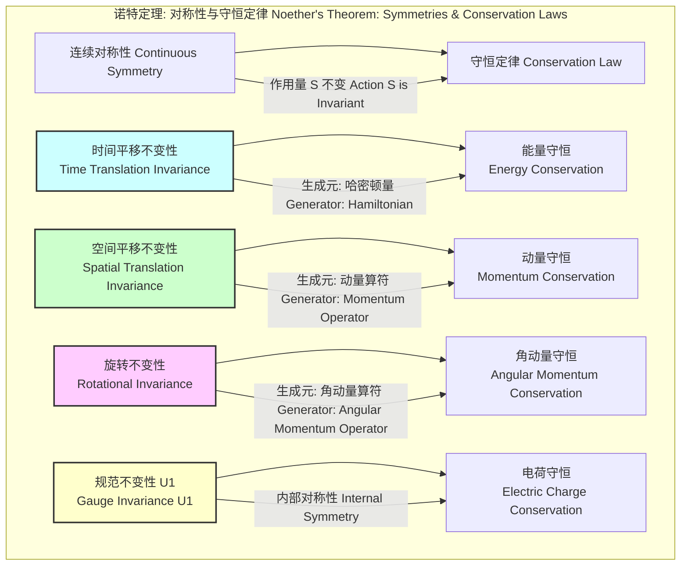

## 时间平移不变性 (time translation invariance)

时间平移不变性是物理学中的一个基本对称性原理。它指出，物理定律不随时间的推移而改变。换句话说，一个物理实验如果在今天进行，和在明天或任何其他时间点进行，只要所有相关的初始条件都相同，其结果也必然相同。这一原理深刻地影响了我们对物理世界的理解，并直接导出了物理学中最核心的守恒定律之一：能量守恒定律。

### 核心概念与数学基础

时间平移不变性意味着物理系统的动力学演化与时间的绝对起点无关。我们可以通过经典力学和量子力学的数学形式来精确地表述这一概念。

#### 经典力学表述

在经典力学的拉格朗日形式中，一个系统的动力学由拉格朗日量 $L(q, \dot{q}, t)$ 决定，其中 $q$ 是广义坐标，$\dot{q}$ 是广义速度，$t$ 是时间。作用量 $S$ 定义为拉格朗日量对时间的积分：

$$ S = \int_{t_1}^{t_2} L(q(t), \dot{q}(t), t) dt $$

其中：
*   $S$: 作用量 (Action)
*   $L(q, \dot{q}, t)$: 拉格朗日量 (Lagrangian)，是系统动能与势能之差。
*   $q(t)$: 广义坐标 (Generalized coordinates)
*   $\dot{q}(t)$: 广义速度 (Generalized velocities)
*   $t$: 时间 (Time)

时间平移不变性意味着拉格朗日量 $L$ 不显含时间 $t$，即：

$$ \frac{\partial L}{\partial t} = 0 $$

根据诺特定理 (Noether's Theorem)，每一个连续的对称性都对应一个守恒量。对于时间平移不变性，这个守恒量就是系统的能量，通常以哈密顿量 $H$ 的形式表示。哈密顿量定义为：

$$ H(p, q) = \sum_i p_i \dot{q}_i - L(q, \dot{q}) $$

其中 $p_i = \frac{\partial L}{\partial \dot{q}_i}$ 是广义动量。哈密顿量的全时间导数为：

$$ \frac{dH}{dt} = \sum_i \left( \dot{p}_i \dot{q}_i + p_i \ddot{q}_i \right) - \sum_i \left( \frac{\partial L}{\partial q_i} \dot{q}_i + \frac{\partial L}{\partial \dot{q}_i} \ddot{q}_i \right) - \frac{\partial L}{\partial t} $$

利用拉格朗日方程 $\dot{p}_i = \frac{d}{dt}\frac{\partial L}{\partial \dot{q}_i} = \frac{\partial L}{\partial q_i}$，上式简化为：

$$ \frac{dH}{dt} = - \frac{\partial L}{\partial t} $$

因此，如果系统具有时间平移不变性（$\frac{\partial L}{\partial t} = 0$），则哈密顿量（能量）是守恒的：

$$ \frac{dH}{dt} = 0 \implies H = \text{const} $$

#### 量子力学表述

在量子力学中，系统状态由希尔伯特空间中的态矢量 $|\psi(t)\rangle$ 描述。其时间演化由薛定谔方程决定：

$$ i\hbar \frac{d}{dt}|\psi(t)\rangle = \hat{H}|\psi(t)\rangle $$

其中：
*   $|\psi(t)\rangle$: 系统在时间 $t$ 的态矢量 (State vector)
*   $\hbar$: 约化普朗克常数 (Reduced Planck constant), $\hbar \approx 1.054 \times 10^{-34} \text{ J} \cdot \text{s}$
*   $\hat{H}$: 哈密顿算符 (Hamiltonian operator)，代表系统的总能量。

一个有限时间平移 $\tau$ 的操作由时间演化算符 $\hat{U}(\tau)$ 实现：

$$ |\psi(t+\tau)\rangle = \hat{U}(\tau)|\psi(t)\rangle $$

如果哈密顿算符 $\hat{H}$ 不显含时间（即 $\frac{\partial \hat{H}}{\partial t} = 0$），则系统具有时间平移不变性。在这种情况下，时间演化算符可以写成：

$$ \hat{U}(\tau) = e^{-i\hat{H}\tau/\hbar} $$

这个算符是一个幺正算符（$\hat{U}^\dagger \hat{U} = I$）。时间平移不变性的核心在于哈密顿算符 $\hat{H}$ 是时间平移变换的生成元。

一个物理量（由厄米算符 $\hat{A}$ 表示）的守恒意味着其期望值不随时间变化，这要求 $\hat{A}$ 与哈密顿算符 $\hat{H}$ 对易：

$$ \frac{d\langle \hat{A} \rangle}{dt} = \frac{1}{i\hbar} \langle [\hat{A}, \hat{H}] \rangle + \left\langle \frac{\partial \hat{A}}{\partial t} \right\rangle = 0 $$

对于能量守恒，我们考察哈密顿算符本身。如果 $\hat{H}$ 不显含时间（$\frac{\partial \hat{H}}{\partial t} = 0$），那么：

$$ [\hat{H}, \hat{H}] = 0 $$

这个对易关系是自然成立的，因此能量的期望值 $\langle \hat{H} \rangle$ 是守恒的。这正是量子力学中能量守恒定律的体现，它直接源于系统哈密顿量的时间平移不变性。

### 关键技术规格

下表总结了时间平移不变性的关键数学特征和物理推论。

| 特征 (Feature) | 经典力学 (Classical Mechanics) | 量子力学 (Quantum Mechanics) |
| :--- | :--- | :--- |
| **对称性变换** | 时间平移: $t \to t' = t + \tau$ | 时间平移: $\hat{U}(\tau) = e^{-i\hat{H}\tau/\hbar}$ |
| **不变性条件** | 拉格朗日量不显含时间: $\frac{\partial L}{\partial t} = 0$ | 哈密顿算符不显含时间: $\frac{\partial \hat{H}}{\partial t} = 0$ |
| **变换生成元** | 哈密顿量 $H$ | 哈密顿算符 $\hat{H}$ |
| **守恒量** | 能量 (哈密顿量) $E = H$ | 能量 (哈密顿算符的本征值) |
| **守恒定律数学形式** | $\frac{dH}{dt} = 0$ | $[\hat{H}, \hat{H}] = 0 \implies \frac{d\langle \hat{H} \rangle}{dt} = 0$ |
| **单位** | 能量单位：焦耳 (J), 电子伏 (eV) | 能量单位：焦耳 (J), 电子伏 (eV) |

### 常见用例与量化性能指标

时间平移不变性是许多物理和工程领域分析的基础。

*   **线性时不变 (LTI) 系统**: 在信号处理和控制理论中，LTI 系统是核心模型。
    *   **定义**: 系统的输出是其输入与系统冲激响应的卷积。这一性质直接依赖于时间平移不变性。如果输入信号延迟 $\tau$，输出信号也将延迟 $\tau$ 而形状不变。
    *   **数学表示**: $y(t) = (x * h)(t) = \int_{-\infty}^{\infty} x(\tau) h(t-\tau) d\tau$。
    *   **性能指标**: 传递函数 $H(f)$ 和频率响应是分析 LTI 系统的关键工具，它们的存在完全依赖于时不变性。例如，一个带通信道滤波器的性能可以用其在通带内的增益平坦度（如 ±0.1 dB）和在阻带内的衰减（如 > 80 dB）来量化。

*   **量子场论与粒子物理**:
    *   **应用**: S矩阵 (S-matrix) 理论用于计算粒子散射过程的概率幅。S矩阵将无穷远的过去 ($t \to -\infty$) 的初态演化到无穷远的未来 ($t \to +\infty$) 的末态。整个理论框架假设了相互作用哈密顿量在时间上的平移不变性。
    *   **性能指标**: 能量守恒是所有粒子反应必须遵循的根本准则。实验上对能量守恒的检验极其精确。例如，在寻找质子衰变或中子-反中子振荡的实验中，对能量守恒破坏的限制极高。对电子稳定性的研究表明，其寿命超过 $6.6 \times 10^{28}$ 年（90%置信水平），这意味着在如此长的时间尺度内，能量自发产生或消失的概率极低。

*   **天体力学与数值模拟**:
    *   **应用**: 模拟太阳系行星的长期轨道演化。由于引力定律是时不变的，整个系统的总能量和角动量应该是守恒的。
    *   **性能指标**: 数值积分器的质量可以通过其保持守恒量的能力来衡量。一个优良的辛积分器 (Symplectic Integrator)，如 Verlet 算法，可以在模拟数百万年轨道周期后，保持系统总能量的相对误差 $\Delta E / E$ 小于 $10^{-10}$。

### 实现考量

在计算物理和工程模拟中，即使底层物理定律是时不变的，数值算法也可能引入误差，破坏这种对称性。

*   **数值积分算法**:
    *   **欧拉法 (Euler Method)**: 最简单但性能最差。它是非辛的，会导致能量随时间系统性地增加或减少。其单步误差为 $O(\Delta t^2)$，全局误差为 $O(\Delta t)$。
    *   **龙格-库塔法 (Runge-Kutta Methods)**: 如 RK4，精度更高（全局误差 $O(\Delta t^4)$），但在长时间积分中仍不能保证能量守恒。
    *   **辛积分器 (Symplectic Integrators)**: 如 Verlet 算法或 Leapfrog 算法。这些算法被设计用于哈密顿系统，虽然它们不能精确保持能量 $H$ 本身，但它们能精确保持一个“影子哈密顿量” $H'$，使得真实能量 $H$ 在长时间内围绕其初始值做有界振荡，而不会出现系统性漂移。对于N体问题，Verlet 算法的计算复杂度通常为 $O(N^2)$（直接计算）或 $O(N \log N)$（使用树形码等优化方法）。

*   **信号处理中的卷积**:
    *   **直接实现**: 根据卷积定义直接计算。如果信号长度为 $N$，滤波器核长度为 $M$，则复杂度为 $O(N \cdot M)$。
    *   **FFT 实现**: 利用卷积定理（时域卷积等价于频域乘积），可以通过快速傅里叶变换 (FFT) 来实现。
        1.  计算输入信号 $x(t)$ 和冲激响应 $h(t)$ 的 FFT，得到 $X(f)$ 和 $H(f)$。复杂度为 $O((N+M)\log(N+M))$。
        2.  在频域中相乘: $Y(f) = X(f) H(f)$。复杂度为 $O(N+M)$。
        3.  计算 $Y(f)$ 的逆 FFT 得到输出信号 $y(t)$。复杂度为 $O((N+M)\log(N+M))$。
    *   **总复杂度**: $O((N+M)\log(N+M))$，对于长信号，这远比直接实现高效。

### 性能特征

时间平移不变性导致的能量守恒具有深刻的性能影响。

*   **系统稳定性**: 在许多物理系统中，能量守恒是系统长期稳定性的前提。例如，一个孤立的、能量守恒的太阳系可以稳定存在数十亿年。任何破坏能量守恒的微小效应（如与星际介质的摩擦）都会导致轨道衰变。
*   **可预测性**: 由于物理规律不随时间改变，我们可以基于当前状态和已知的动力学方程，精确预测系统的未来状态或推断其过去状态。
*   **统计测量**: 在验证能量守恒的实验中，统计不确定性和系统误差是关键。例如，在测量核反应的 Q 值时，最终结果通常表示为 $Q = (X \pm \delta_X) \text{ MeV}$，其中 $\delta_X$ 是包含统计和系统误差在内的合成标准不确定度。对能量守恒的检验可以表述为寻找一个非零的 $\Delta E = E_{\text{final}} - E_{\text{initial}}$，目前的实验结果在极高的精度上与 $\Delta E = 0$ 一致。例如，寻找“无中微子双贝塔衰变”的实验就是在检验一个破坏轻子数守恒（也与能量-动量有关）的过程，其半衰期下限已达到 $10^{26}$ 年量级，这意味着能量守恒在这些过程中得到了高度验证。

### 相关技术与比较

时间平移不变性是物理学中众多对称性之一。理解其与其他对称性的关系有助于更全面地认识守恒定律的起源。诺特定理将连续对称性与守恒量联系起来。

下表比较了不同对称性的数学模型：

| 对称性 (Symmetry) | 变换 (Transformation) | 不变性条件 (Invariance Condition) | 守恒量 (Conserved Quantity) |
| :--- | :--- | :--- | :--- |
| **时间平移** | $t \to t+\tau$ | $\frac{\partial L}{\partial t} = 0$ | 能量 $E$ |
| **空间平移** | $\vec{r} \to \vec{r}+\vec{a}$ | $\frac{\partial L}{\partial \vec{r}} = 0$ (对于孤立系统) | 动量 $\vec{p}$ |
| **旋转** | $\vec{r} \to R\vec{r}$ ($R$为旋转矩阵) | $L$ 在旋转下为标量 | 角动量 $\vec{L}$ |
| **U(1)规范变换** | $\psi \to e^{i\alpha(x)}\psi$ | 拉格朗日量在变换下不变 | 电荷 $Q$ |

### 参考文献

1.  Noether, E. (1918). Invariante Variationsprobleme. *Nachrichten von der Gesellschaft der Wissenschaften zu Göttingen, Mathematisch-Physikalische Klasse*, 1918, 235–257. (诺特定理的原始论文). A modern translation and commentary can be found in: Kosmann-Schwarzbach, Y. (2011). *The Noether Theorems*. Springer. DOI: [10.1007/978-0-387-87868-3](https://doi.org/10.1007/978-0-387-87868-3).
2.  Goldstein, H., Poole, C. P., & Safko, J. L. (2002). *Classical Mechanics* (3rd ed.). Addison Wesley. (经典力学中关于对称性与守恒定律的权威论述).
3.  Peskin, M. E., & Schroeder, D. V. (1995). *An Introduction to Quantum Field Theory*. Westview Press. (量子场论中关于对称性、诺特定理和S矩阵的详细介绍).
4.  Agostini, M., et al. (GERDA Collaboration). (2019). Probing the Majoron-emitting modes of the neutrinoless double-β decay. *Physical Review Letters*, 123(16), 161801. DOI: [10.1103/PhysRevLett.123.161801](https://doi.org/10.1103/PhysRevLett.123.161801). (这类实验通过寻找稀有衰变来为能量守恒等基本定律设置严格的实验限制).