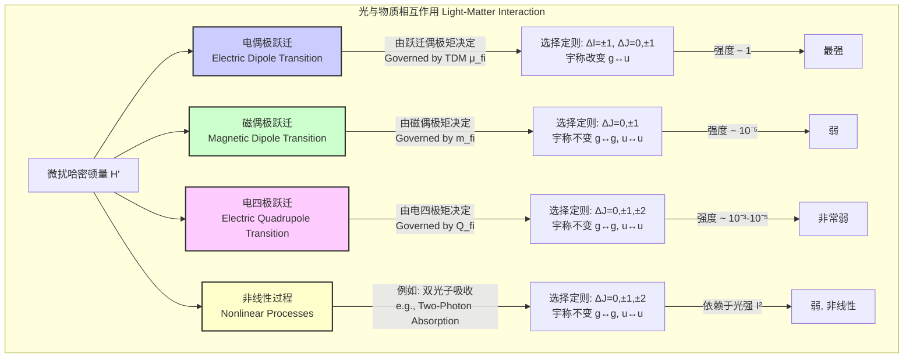

## 跃迁偶极矩 (transition dipole moment)

跃迁偶极矩（Transition Dipole Moment, TDM），通常表示为 $\vec{\mu}_{fi}$，是量子力学中一个核心概念，用于描述原子或分子在两个不同量子态之间因与电磁辐射相互作用而发生跃迁的概率。它是一个矢量，其大小决定了跃迁的强度，其方向决定了跃迁对光的偏振的依赖性。从物理上看，跃迁偶极矩代表了在量子跃迁过程中电荷分布瞬时变化的程度。如果一个跃迁的跃迁偶极矩为零，则该跃迁在电偶极近似下是“禁戒”的，意味着它极不可能发生。

### 核心概念与数学基础

跃迁偶极矩是从初态 $\psi_i$ 到末态 $\psi_f$ 的跃迁矩阵元，其算符为电偶极矩算符 $\hat{\vec{\mu}}$。

#### 数学定义

在量子力学中，跃迁偶极矩定义为：

$$
\vec{\mu}_{fi} = \langle \psi_f | \hat{\vec{\mu}} | \psi_i \rangle = \int \psi_f^* \hat{\vec{\mu}} \psi_i \, d\tau
$$

其中：
*   $\psi_i$ 是系统的初始态波函数。
*   $\psi_f$ 是系统的末态波函数。
*   $\psi_f^*$ 是末态波函数的复共轭。
*   $\hat{\vec{\mu}}$ 是电偶极矩算符。
*   $\int ... \, d\tau$ 表示对所有相关坐标（电子和核的空间与自旋坐标）进行积分。

电偶极矩算符 $\hat{\vec{\mu}}$ 定义为体系中所有带电粒子的电荷 $q_k$ 与其位置矢量 $\hat{\vec{r}}_k$ 的乘积之和：

$$
\hat{\vec{\mu}} = \sum_k q_k \hat{\vec{r}}_k
$$

对于一个包含 $N$ 个电子和 $M$ 个原子核的分子，该算符可以写为：

$$
\hat{\vec{\mu}} = -e \sum_{j=1}^{N} \hat{\vec{r}}_j + \sum_{\alpha=1}^{M} Z_\alpha e \hat{\vec{R}}_\alpha
$$

其中：
*   $-e$ 是电子的电荷。
*   $\hat{\vec{r}}_j$ 是第 $j$ 个电子的位置算符。
*   $Z_\alpha e$ 是第 $\alpha$ 个原子核的电荷。
*   $\hat{\vec{R}}_\alpha$ 是第 $\alpha$ 个原子核的位置算符。

#### 与光谱跃迁强度的关系

跃迁偶极矩的大小直接决定了光谱线的强度。根据费米黄金定则（Fermi's Golden Rule），从初态 $i$ 到末态 $f$ 的跃迁速率 $W_{i \to f}$ 与跃迁矩阵元的平方成正比。在电偶极近似下，光与物质相互作用的微扰哈密顿量为 $\hat{H}' = -\hat{\vec{\mu}} \cdot \vec{E}(t)$，其中 $\vec{E}(t)$ 是电磁波的电场矢量。

跃迁速率 $W_{i \to f}$ 为：

$$
W_{i \to f} \propto |\langle \psi_f | \hat{H}' | \psi_i \rangle|^2 \propto |\langle \psi_f | -\hat{\vec{\mu}} \cdot \vec{E}_0 | \psi_i \rangle|^2 = |\vec{E}_0 \cdot \vec{\mu}_{fi}|^2
$$

对所有可能的方向取平均后，跃迁速率与跃迁偶极矩的模平方 $|\vec{\mu}_{fi}|^2$ 成正比。这个模平方也被称为**跃迁偶极强度**（dipole strength），$D_{fi} = |\vec{\mu}_{fi}|^2$。

#### 选择定则 (Selection Rules)

选择定则是判断跃迁偶极矩是否为零的规则。
*   **允许跃迁 (Allowed Transition)**: 如果 $\vec{\mu}_{fi} \neq 0$，跃迁是允许的，光谱中会出现强吸收/发射。
*   **禁戒跃迁 (Forbidden Transition)**: 如果 $\vec{\mu}_{fi} = 0$，跃迁是禁戒的，其强度非常弱（可能通过磁偶极或电四极等更高阶矩发生）。

一个重要的选择定则是**拉波特规则 (Laporte Rule)**，它指出对于具有反演中心的体系（中心对称），允许的电偶极跃迁必须伴随着宇称的改变（g → u 或 u → g）。这是因为电偶极矩算符 $\hat{\vec{\mu}}$ 是一个奇函数（宇称为 u，ungerade），而波函数的宇称为 g (gerade) 或 u。根据群论，积分 $\int \psi_f^* \hat{\vec{\mu}} \psi_i \, d\tau$ 不为零的条件是，被积函数的对称性必须包含全对称表示。对于中心对称群，这意味着 $\Gamma(\psi_f) \otimes \Gamma(\hat{\mu}) \otimes \Gamma(\psi_i)$ 必须包含 A_g 表示。由于 $\Gamma(\hat{\mu})$ 是 u，这要求 $\psi_f$ 和 $\psi_i$ 的宇称必须相反。

### 关键技术规格

跃迁偶极矩的典型值因跃迁类型而异。其常用单位是德拜 (Debye, D) 和库仑·米 (C·m)。
**单位换算**: $1 \text{ D} \approx 3.33564 \times 10^{-30} \text{ C·m}$。

| 跃迁类型 | 典型量级 (Debye) | 典型量级 (C·m) | 备注 |
| :--- | :--- | :--- | :--- |
| 强电子跃迁 ($\pi \to \pi^*$) | 1 – 10 D | $3.3 \times 10^{-30}$ – $3.3 \times 10^{-29}$ | 具有高振子强度，例如在共轭多烯中。 |
| 弱电子跃迁 ($n \to \pi^*$) | 0.01 – 0.1 D | $3.3 \times 10^{-32}$ – $3.3 \times 10^{-31}$ | 因轨道空间重叠小而通常较弱，部分禁戒。 |
| 分子振动跃迁 (IR) | 0.01 – 1 D | $3.3 \times 10^{-32}$ – $3.3 \times 10^{-30}$ | 仅当振动导致分子偶极矩变化时才为红外活性。 |
| 分子转动跃迁 (Microwave) | 等于基态偶极矩 | 等于基态偶极矩 | 仅适用于具有永久偶极矩的极性分子。 |

### 常见用例

跃迁偶极矩是连接理论计算和实验光谱学的桥梁。

*   **光谱分析**:
    *   **振子强度 (Oscillator Strength)** $f_{fi}$：一个无量纲量，与跃迁偶极强度成正比，描述了跃迁强度相对于一个经典谐振子的强度。
        $$ f_{fi} = \frac{2 m_e \omega_{fi}}{3 \hbar e^2} |\vec{\mu}_{fi}|^2 $$
        其中 $\omega_{fi} = (E_f - E_i)/\hbar$ 是跃迁角频率。
    *   **爱因斯坦系数 (Einstein Coefficients)**：自发辐射系数 $A_{fi}$ 和受激吸收/辐射系数 $B_{fi}$ 均与 $|\vec{\mu}_{fi}|^2$ 成正比。
        $$ A_{fi} = \frac{\omega_{fi}^3}{3 \pi \epsilon_0 \hbar c^3} |\vec{\mu}_{fi}|^2 \quad ; \quad B_{fi} = \frac{\pi}{3 \epsilon_0 \hbar^2} |\vec{\mu}_{fi}|^2 $$
    *   **摩尔吸光系数 (Molar Absorptivity)** $\epsilon$：根据比尔-朗伯定律，积分摩尔吸光系数与跃迁偶极强度直接相关。
        $$ \int_{\text{band}} \epsilon(\nu) \, d\nu = \frac{N_A h \nu_{fi}}{3 \epsilon_0 c \ln(10)} \left( \frac{\pi}{3 \hbar^2} |\vec{\mu}_{fi}|^2 \right) \propto |\vec{\mu}_{fi}|^2 $$

*   **材料科学**:
    *   **有机发光二极管 (OLEDs)**：设计具有大跃迁偶极矩的荧光或磷光材料，以实现高的辐射衰减速率和光致发光量子产率。
    *   **光伏 (Photovoltaics)**：在染料敏化太阳能电池或有机光伏中，施主-受主分子之间强的电荷转移跃迁（对应大的TDM）对于高效的光生电荷分离至关重要。
    *   **非线性光学 (Nonlinear Optics)**：超极化率等非线性光学性质的计算与跃迁偶极矩和态间耦合密切相关。

### 实现考量

跃迁偶极矩通常通过量子化学计算软件（如 Gaussian, Q-Chem, ORCA）进行计算。

*   **计算方法**:
    *   **密度泛函理论 (DFT)** 及其含时扩展 **TD-DFT** 是计算大中型分子电子跃迁TDM最常用的方法。
    *   **波函数理论方法**：如哈特里-福克 (HF)、组态相互作用 (CI)、耦合簇理论 (CC) 等提供了更高精度的结果，但计算成本也更高。
*   **算法复杂度**:
    *   计算的瓶颈通常在于求解基态和激发态的波函数/电子密度。
    *   对于 DFT 和 TD-DFT，计算复杂度通常随体系大小（以基函数数量 $N$ 计）的增加而呈 $O(N^3)$ 到 $O(N^4)$ 的增长。
    *   高精度的耦合簇方法，如 CCSD(T)，其复杂度高达 $O(N^7)$，限制了其在小体系中的应用。
*   **基组选择**:
    *   基组的选择对TDM的计算精度至关重要。
    *   需要使用足够灵活的基组来准确描述分子在不同电子态下的电荷分布。
    *   通常推荐使用包含**弥散函数 (diffuse functions)**（如 `+` 或 `aug-` 前缀）和**极化函数 (polarization functions)**（如 `(d,p)`）的基组，例如 `6-311++G(d,p)` 或 `aug-cc-pVTZ`。

### 性能特征

计算得到的TDM值的准确性依赖于所选的理论方法和基组。

*   **准确性**:
    *   与实验值相比，TD-DFT 使用标准泛函（如 B3LYP, PBE0）计算的TDM值，其典型误差在 10-30% 范围内。
    *   对于电荷转移激发，标准TD-DFT方法可能会严重低估TDM，需要使用范围分离泛函（range-separated functionals）进行校正。
    *   高水平的波函数方法（如 EOM-CCSD 或 CASPT2）可以将误差减小到 5% 以内，但计算成本极高。
*   **统计度量**:
    *   在基准测试研究中，通常使用**平均绝对误差 (Mean Absolute Error, MAE)** 或**均方根偏差 (Root Mean Square Deviation, RMSD)** 来评估不同计算方法的性能。
    *   例如，在一组标准有机分子的基准测试集上（如 Thiel's benchmark set），TD-B3LYP/def2-TZVP 方法计算的TDM值的RMSD可能在 0.2-0.4 Debye 之间。
*   **置信区间**: 尽管在研究论文中不常见，但严谨的计算报告应考虑由于理论方法、基组选择和几何结构不确定性而引入的误差范围，并给出结果的置信区间。

### 相关技术与比较

电偶极跃迁是最主要的吸收和发射机制，但不是唯一的。当 $\vec{\mu}_{fi}=0$ 时，其他更高阶的相互作用可能变得重要。

#### 比较数学模型

*   **磁偶极跃迁 (Magnetic Dipole Transition)**:
    *   相互作用算符: $\hat{\vec{m}} = -\frac{e}{2m_e}(\hat{\vec{L}} + g_e \hat{\vec{S}})$，其中 $\hat{\vec{L}}$ 是轨道角动量算符，$\hat{\vec{S}}$ 是自旋角动量算符。
    *   跃迁矩阵元: $\vec{m}_{fi} = \langle \psi_f | \hat{\vec{m}} | \psi_i \rangle$。
    *   相对强度: 通常比电偶极跃迁弱 $10^4 - 10^6$ 倍。
    *   选择定则: 宇称必须保持不变 (g → g, u → u)。

*   **电四极跃迁 (Electric Quadrupole Transition)**:
    *   相互作用算符: $\hat{Q}_{\alpha\beta} = \sum_k q_k (3r_{k,\alpha}r_{k,\beta} - r_k^2 \delta_{\alpha\beta})$，其中 $\alpha, \beta$ 代表 $x, y, z$ 坐标。
    *   跃迁矩阵元: $Q_{fi} = \langle \psi_f | \hat{Q} | \psi_i \rangle$。
    *   相对强度: 通常比电偶极跃迁弱 $10^3 - 10^5$ 倍。
    *   选择定则: 宇称必须保持不变 (g → g, u → u)。

*   **双光子吸收 (Two-Photon Absorption, TPA)**:
    *   一种非线性过程，其跃迁概率与光强的平方成正比。
    *   选择定则通常与单光子吸收相反，例如，对于中心对称体系，g → g 和 u → u 跃迁是允许的。
    *   其强度由双光子吸收截面 $\sigma^{(2)}$ 描述，该截面涉及对所有可能中间态的跃迁偶极矩的求和。

### 参考文献

1.  Atkins, P., & Friedman, R. (2011). *Molecular Quantum Mechanics* (5th ed.). Oxford University Press. (A foundational textbook covering the principles of TDM).
2.  Dreizler, R. M., & Gross, E. K. U. (1990). *Density Functional Theory: An Approach to the Quantum Many-Body Problem*. Springer-Verlag. DOI: [10.1007/978-3-642-86105-5](https://doi.org/10.1007/978-3-642-86105-5). (Provides the theoretical basis for DFT calculations).
3.  Laurent, A. D., & Jacquemin, D. (2013). TD-DFT benchmarks: A review. *International Journal of Quantum Chemistry*, 113(17), 2019-2039. DOI: [10.1002/qua.24438](https://doi.org/10.1002/qua.24438). (A comprehensive review on the performance of TD-DFT for various properties, including transition moments).
4.  Schreiber, M., Silva-Junior, M. R., Sauer, S. P., & Thiel, W. (2008). Benchmarks for electronically excited states: CASPT2, CC2, CCSD, and CC3. *The Journal of Chemical Physics*, 128(13), 134110. DOI: [10.1063/1.2889385](https://doi.org/10.1063/1.2889385). (A key benchmark study for excited state calculations, providing reference values for TDM).