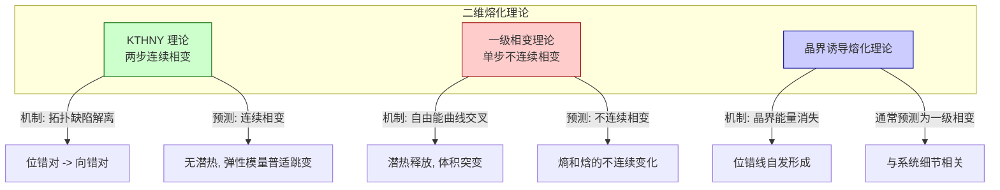

## 两相熔化 (Two-Phase Melting)

两相熔化是一种在二维 (2D) 系统中观察到的物理现象，其熔化过程通过两个连续的、性质不同的相变完成，而非像三维系统中那样通过单一的一阶相变完成。该理论的核心是 Kosterlitz-Thouless-Halperin-Nelson-Young (KTHNY) 理论，它描述了晶体如何通过拓扑缺陷的解离（解绑定）而失去其序。

该过程包括两个步骤：
1.  **固相到六角相 (Solid to Hexatic) 的转变**：在较低的熔化温度 $T_m$ 下，晶格中的位错对 (dislocation pairs) 开始解离。这破坏了系统的准长程位置序，但保留了准长程的取向序。
2.  **六角相到各向同性液相 (Hexatic to Isotropic Liquid) 的转变**：在较高的温度 $T_i$ 下，六角相中剩余的向错对 (disclination pairs) 解离，从而破坏了剩余的取向序，系统转变为完全无序的液相。

### 核心概念与数学基础

KTHNY 理论通过分析不同相中的序参量相关函数来描述熔化过程。

#### 1. 序与相关函数

*   **位置序 (Positional Order)**: 通过平移相关函数 $g_G(r)$ 来表征。
    $$
    g_G(\mathbf{r}) = \langle e^{i\mathbf{G} \cdot [\mathbf{u}(\mathbf{r}) - \mathbf{u}(0)]} \rangle
    $$
    其中：
    *   $\mathbf{G}$ 是一个倒格矢 (reciprocal lattice vector)。
    *   $\mathbf{u}(\mathbf{r})$ 是在位置 $\mathbf{r}$ 处的原子相对于其格点的位移场。
    *   $\langle \cdot \rangle$ 表示热力学平均。

*   **取向序 (Orientational Order)**: 通过键角取向相关函数 $g_6(r)$ 来表征。首先定义局部取向序参量 $\psi_6(\mathbf{r}_j) = \frac{1}{N_j} \sum_{k=1}^{N_j} e^{i6\theta_{jk}}$，其中 $\theta_{jk}$ 是连接粒子 $j$ 与其近邻粒子 $k$ 的键的取向角。
    $$
    g_6(r) = \langle \psi_6(\mathbf{r}) \psi_6^*(0) \rangle = \langle e^{i6[\theta(\mathbf{r}) - \theta(0)]} \rangle
    $$
    其中：
    *   $\theta(\mathbf{r})$ 是在位置 $\mathbf{r}$ 处的局部晶格轴的取向角。
    *   $\psi_6^*$ 是 $\psi_6$ 的复共轭。

不同相中相关函数的行为如下：
*   **固相 ($T < T_m$)**: 准长程位置序 ($g_G(r) \sim r^{-\eta_G(T)}$) 和长程取向序 ($g_6(r) \to \text{const}$)。
*   **六角相 ($T_m < T < T_i$)**: 短程位置序 ($g_G(r) \sim e^{-r/\xi_G}$) 和准长程取向序 ($g_6(r) \sim r^{-\eta_6(T)}$)。
*   **液相 ($T > T_i$)**: 短程位置序 ($g_G(r) \sim e^{-r/\xi_G'}$) 和短程取向序 ($g_6(r) \sim e^{-r/\xi_6}$)。

#### 2. 拓扑缺陷

熔化过程由拓扑缺陷的解离驱动。
*   **位错 (Dislocations)**: 局部晶格中的平移对称性破缺，由一个柏格斯矢量 (Burgers vector) $\mathbf{b}$ 表征。在二维三角晶格中，最小的柏格斯矢量是晶格矢量。一个位错可以看作是一个紧密束缚的五重-七重向错对。
*   **向错 (Disclinations)**: 局部晶格中的旋转对称性破缺。在六配位的三角晶格中，一个五重缺陷（配位数为5）和一个七重缺陷（配位数为7）是基本的向错。

#### 3. Kosterlitz-Thouless (KT) 跃迁机制

两个缺陷（例如位错-反位错对）之间的相互作用能与它们的间距 $r$ 成对数关系：$U(r) \sim K \ln(r/a_0)$，其中 $K$ 是一个弹性常数（有效刚度），$a_0$ 是缺陷核心尺寸。
缺陷对的熵也与间距成对数关系：$S(r) \sim k_B \ln(r/a_0)$。
系统的自由能为 $F = U - TS = (K - 2k_B T) \ln(r/a_0)$。
*   当 $T < K/(2k_B)$ 时，$F$ 随 $r$ 增加，缺陷对倾向于束缚。
*   当 $T > K/(2k_B)$ 时，$F$ 随 $r$ 减小，缺陷对倾向于解离，导致自由缺陷出现，破坏序。

#### 4. 重整化群 (Renormalization Group) 方程

KTHNY 理论使用重整化群方法来描述系统在不同尺度下的行为。对于固相-六角相转变，RG 流动方程为：
$$
\frac{dK^{-1}(l)}{dl} = C y^2(l) e^{-K(l)/4\pi}
$$
$$
\frac{dy(l)}{dl} = \left(2 - \frac{K(l)}{8\pi}\right) y(l)
$$
其中：
*   $l = \ln(r/a_0)$ 是尺度因子。
*   $K(l)$ 是尺度依赖的有效杨氏模量组合。
*   $y(l)$ 是位错核心能量的逸度 (fugacity)。
*   $C$ 是一个常数。

当 $K(l)$ 达到一个临界值时，转变发生。

---

### 关键技术规格

| 参数/规格 | 理论预测值 | 描述 | 单位 |
| :--- | :--- | :--- | :--- |
| **杨氏模量跃迁** | $K(T_m^-) = 16\pi$ | 在固-六角相变温度 $T_m$ 处，无量纲杨氏模量 $K = \frac{Y_s a_0^2}{k_B T_m}$ 发生普适性跃变。$Y_s$ 是二维杨氏模量。 | 无量纲 |
| **Frank 常数跃迁** | $K_A^R(T_i^-) = \frac{72}{\pi}$ | 在六角-液相转变温度 $T_i$ 处，重整化的 Frank 常数 $K_A^R$ 达到一个普适值。 | 无量纲 |
| **位置相关函数指数** | $\eta_G(T_m^-) \in [1/4, 1/3]$ | 在 $T_m$ 处，位置相关函数的衰减指数 $\eta_G$ 取决于倒格矢 $\mathbf{G}$。 | 无量纲 |
| **取向相关函数指数** | $\eta_6(T_m) = 1/4$ | 在 $T_m$ 处，六重取向相关函数的衰减指数 $\eta_6$ 为 $1/4$。 | 无量纲 |
| **相关长度指数** | $\nu = 0.36963...$ | 接近 $T_m$ 时，相关长度的发散指数 $\xi \sim \exp[b(T-T_m)^{-\nu}]$。 | 无量纲 |

---

### 常见用例与性能指标

| 应用领域 | 系统实例 | 关键性能指标/观测结果 |
| :--- | :--- | :--- |
| **胶体物理** | 限制在水-空气界面的聚苯乙烯微球单层膜 | - 通过视频显微镜直接观测到六角相的存在。<br>- 测量的相关函数 $g_G(r)$ 和 $g_6(r)$ 的衰减指数与 KTHNY 理论预测一致。<br>- 缺陷（位错和向错）的可视化。 |
| **软物质** | 堆叠的液晶膜（如 Smectic-B 相） | - X射线衍射实验显示出从幂律衰减到指数衰减的转变，证实了准长程序的存在。<br>- 热容测量显示出两个微弱的异常峰，分别对应 $T_m$ 和 $T_i$。 |
| **超导物理** | II 型超导体薄膜中的磁通线晶格 | - 输运测量（如电阻率、I-V 曲线）显示出在熔化过程中的阶段性变化。<br>- 磁通晶格的剪切模量在熔化时表现出与理论预测相符的突变。 |
| **表面物理** | 液氦表面的二维电子气（维格纳晶体） | - 通过测量对剪切形变的响应来确定剪切模量，观测到其在 $T_m$ 处的普适性跃变。<br>- 这是一个研究 KTHNY 理论的极其洁净和理想的系统。 |

---

### 实现考量与算法分析

在计算模拟中研究两相熔化通常涉及以下方法：

*   **蒙特卡洛 (Monte Carlo, MC) 模拟**:
    *   **算法**: 使用 Metropolis-Hastings 算法模拟一个由 $N$ 个粒子组成的系统，粒子间通过特定势函数（如 Lennard-Jones 势、硬盘势）相互作用。
    *   **复杂度**: 对于短程相互作用，使用单元列表 (cell lists) 或 Verlet 列表可以将每次迭代的计算复杂度从 $O(N^2)$ 优化到 $O(N)$。计算相关函数通常需要 $O(N^2)$，但可以通过基于 FFT 的方法优化到 $O(N \log N)$。

*   **分子动力学 (Molecular Dynamics, MD) 模拟**:
    *   **算法**: 对系统中的每个粒子求解牛顿运动方程，可以研究动力学性质，如扩散系数和动态结构因子。
    *   **复杂度**: 与 MC 模拟类似，力计算的复杂度是主要瓶颈，通常为 $O(N)$（使用近邻列表）。

*   **数据分析**:
    *   **粒子追踪**: 从实验图像或模拟快照中提取粒子坐标。
    *   **序参量计算**: 计算每个粒子的 $\psi_6$ 值，并由此计算 $g_6(r)$。
    *   **相关函数拟合**: 使用幂律函数 $A r^{-\eta}$ 或指数函数 $B e^{-r/\xi}$ 对计算出的相关函数进行拟合，以确定相态和临界指数。拟合优度（如 $\chi^2$ 检验）是评估结果可靠性的关键。

```mermaid
graph TD
    subgraph "KTHNY 两相熔化过程"
        Solid["固相 Solid Phase<br>T < T<sub>m</sub><br>准长程位置序<br>长程取向序"]
        Hexatic["六角相 Hexatic Phase<br>T<sub>m</sub> < T < T<sub>i</sub><br>短程位置序<br>准长程取向序"]
        Liquid["液相 Liquid Phase<br>T > T<sub>i</sub><br>短程位置序<br>短程取向序"]
    end

    Solid -- "温度升高<br>位错对解离 Dislocation Unbinding" -->|T<sub>m</sub>| Hexatic
    Hexatic -- "温度进一步升高<br>向错对解离 Disclination Unbinding" -->|T<sub>i</sub>| Liquid

    style Solid fill:#add8e6,stroke:#333
    style Hexatic fill:#fffacd,stroke:#333
    style Liquid fill:#ffcccb,stroke:#333
```

---

### 性能特征与统计度量

*   **比热 (Specific Heat)**: KTHNY 转变是连续相变（无限阶），因此比热在 $T_m$ 和 $T_i$ 处不会出现像一阶相变那样的潜热峰（$\delta$ 函数），而是表现为平滑的、宽泛的峰值或尖点。
*   **弹性模量 (Elastic Moduli)**:
    *   剪切模量 (Shear Modulus) $Y_s$ 在固相中为有限值，在 $T_m$ 处不连续地跳变为零。
    *   体积模量 (Bulk Modulus) $B$ 在整个熔化过程中保持有限值。
*   **临界指数 (Critical Exponents)**: 实验和模拟结果通常通过拟合得到临界指数，并与理论值进行比较。例如，测量得到的 $\eta_6(T_m)$ 值应接近 $1/4$。结果通常表示为 `值 ± 标准误差`，并附有置信区间（如 95% CI）。
*   **磁化率 (Susceptibility)**: 对应于序参量的磁化率，如取向磁化率 $\chi_6 = \int d^2r \, g_6(r)$，在接近 $T_i$ 时会发散，$\chi_6 \sim |T-T_i|^{-\gamma}$。

---

### 相关技术与比较数学模型



*   **一级熔化 (First-Order Melting)**:
    *   **描述**: 传统的三维熔化模型，通过单一的不连续相变完成。在相变温度下，固相和液相共存，系统吸收潜热。
    *   **数学模型**: 朗道理论 (Landau Theory)。自由能 $F$ 作为序参量 $\phi$ 的函数展开，包含奇次项（如 $\phi^3$），导致自由能出现两个极小值，从而发生不连续相变。
        $$
        F(\phi, T) = A(T-T_c)\phi^2 - B\phi^3 + C\phi^4
        $$
        其中 $B \neq 0$ 导致一级相变。

*   **晶界诱导熔化 (Grain Boundary Induced Melting)**:
    *   **描述**: 由 Chui 等人提出的另一种二维熔化理论。该理论认为，当形成晶界（即位错线）的能量变为零或负值时，系统会自发产生大量晶界，从而导致熔化。
    *   **数学模型**: 计算晶界的形成能。这种机制通常（但不总是）导致一级相变，与 KTHNY 理论的连续相变形成对比。

*   **XY 模型**:
    *   **描述**: KTHNY 理论与二维 XY 模型的 Kosterlitz-Thouless (KT) 转变有深刻的联系。XY 模型描述了在平面上可以自由旋转的自旋。
    *   **数学模型**: 其哈密顿量为 $H = -J \sum_{\langle i,j \rangle} \mathbf{S}_i \cdot \mathbf{S}_j = -J \sum_{\langle i,j \rangle} \cos(\phi_i - \phi_j)$。该模型在 KT 温度下发生涡旋-反涡旋对的解离，这与 KTHNY 理论中的位错对解离在数学上是等价的。固相-六角相的转变可以映射到一个修改版的 XY 模型。

---

### 参考文献

1.  Kosterlitz, J. M., & Thouless, D. J. (1973). Ordering, metastability and phase transitions in two-dimensional systems. *Journal of Physics C: Solid State Physics*, 6(7), 1181. **DOI**: [10.1088/0022-3719/6/7/010](https://doi.org/10.1088/0022-3719/6/7/010)
2.  Halperin, B. I., & Nelson, D. R. (1978). Theory of Two-Dimensional Melting. *Physical Review Letters*, 41(2), 121–124. **DOI**: [10.1103/PhysRevLett.41.121](https://doi.org/10.1103/PhysRevLett.41.121)
3.  Young, A. P. (1979). Melting and the vector Coulomb gas in two dimensions. *Physical Review B*, 19(4), 1855–1866. **DOI**: [10.1103/PhysRevB.19.1855](https://doi.org/10.1103/PhysRevB.19.1855)
4.  Zahn, K., Lenke, R., & Maret, G. (2000). Two-Stage Melting of a 2D Colloidal Crystal. *Physical Review Letters*, 84(1), 77-80. **DOI**: [10.1103/PhysRevLett.84.77](https://doi.org/10.1103/PhysRevLett.84.77)