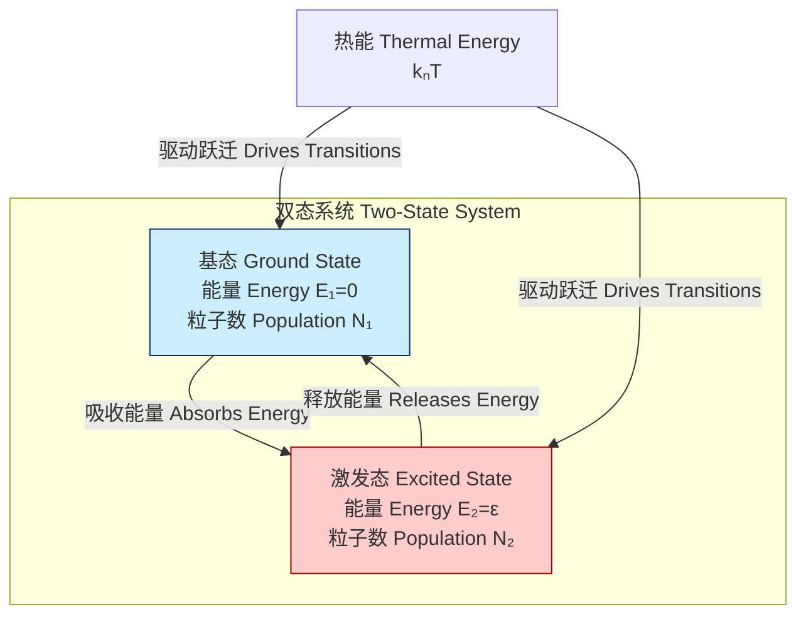
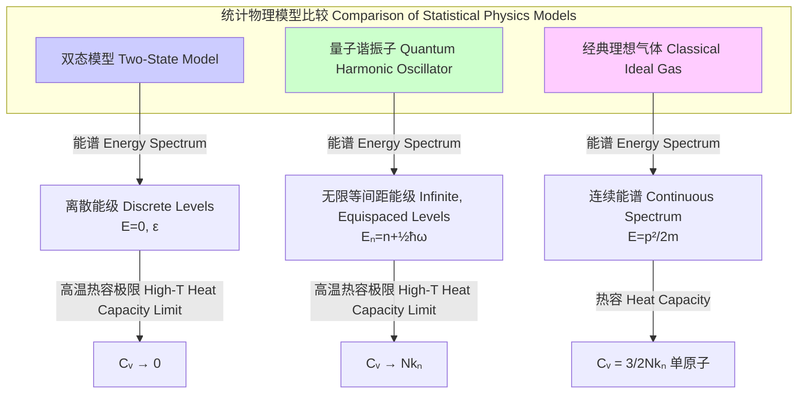

## 双态热力学模型 (two state thermodynamics model)

双态热力学模型是统计力学中的一个基本模型。它描述了一个由 N 个相同的、无相互作用的粒子组成的系统，其中每个粒子只能存在于两个具有不同能量的量子态之一。尽管该模型非常简单，但它为理解复杂系统的热力学行为提供了深刻的见解，并成功地解释了顺磁性、低温固体的热容以及双态缺陷等多种物理现象。

### 核心概念与数学基础

该模型的核心是计算系统的配分函数 (Partition Function)，并由此推导出所有宏观热力学量。

假设每个粒子可以处于两个能级：基态能量 $E_1$ 和激发态能量 $E_2$。为简化计算，我们通常设定 $E_1 = 0$，$E_2 = \epsilon$，其中 $\epsilon > 0$ 是两个能级之间的能量差。

#### 单粒子配分函数 (z)
单个粒子的配分函数是其所有可能状态的玻尔兹曼因子之和。
$$ z = \sum_{i=1}^{2} e^{-E_i / (k_B T)} = e^{-0 / (k_B T)} + e^{-\epsilon / (k_B T)} = 1 + e^{-\epsilon / (k_B T)} $$
其中：
*   $z$: 单粒子配分函数（无量纲）。
*   $\epsilon$: 两个能级之间的能量差 ($E_2 - E_1$)，单位为焦耳 (J)。
*   $k_B$: 玻尔兹曼常数，其值为 $1.380649 \times 10^{-23}$ J/K。
*   $T$: 绝对温度，单位为开尔文 (K)。

#### 状态概率
根据玻尔兹曼分布，粒子处于各个状态的概率为：
*   处于基态 ($E_1=0$) 的概率 $P_1$:
    $$ P_1 = \frac{e^{-E_1 / (k_B T)}}{z} = \frac{1}{1 + e^{-\epsilon / (k_B T)}} $$
*   处于激发态 ($E_2=\epsilon$) 的概率 $P_2$:
    $$ P_2 = \frac{e^{-E_2 / (k_B T)}}{z} = \frac{e^{-\epsilon / (k_B T)}}{1 + e^{-\epsilon / (k_B T)}} $$

#### N 粒子配分函数 (Z)
对于一个由 N 个无相互作用且可区分的粒子组成的系统（例如，固定在晶格上的自旋），总配分函数是单粒子配分函数的 N 次方。
$$ Z = z^N = (1 + e^{-\epsilon / (k_B T)})^N $$
如果粒子是不可区分的（例如，理想气体），则配分函数需要除以 $N!$。在许多应用中，粒子是局域化的，因此可视为可区分。

#### 热力学性质推导
所有宏观热力学性质都可以从 N 粒子配分函数 $Z$ 导出。

*   **亥姆霍兹自由能 (F):**
    $$ F = -k_B T \ln Z = -N k_B T \ln(1 + e^{-\epsilon / (k_B T)}) $$
    $F$ 代表在恒定温度和体积下，从封闭热力学系统可获得的有用功。

*   **平均内能 (U):**
    $$ U = \langle E \rangle = N \langle E_{\text{particle}} \rangle = N(P_1 E_1 + P_2 E_2) = \frac{N\epsilon}{e^{\epsilon / (k_B T)} + 1} $$
    也可以通过对配分函数求导得到：
    $$ U = k_B T^2 \frac{\partial \ln Z}{\partial T} = k_B T^2 \frac{\partial}{\partial T} [N \ln(1 + e^{-\epsilon / (k_B T)})] = \frac{N\epsilon e^{-\epsilon / (k_B T)}}{1 + e^{-\epsilon / (k_B T)}} $$

*   **熵 (S):**
    $$ S = -\left(\frac{\partial F}{\partial T}\right)_V = \frac{U-F}{T} = N k_B \left[ \ln(1 + e^{-\epsilon / (k_B T)}) + \frac{\epsilon/(k_B T)}{e^{\epsilon / (k_B T)} + 1} \right] $$
    熵度量了系统的微观无序度。
    *   当 $T \to 0$ 时，$P_1 \to 1, P_2 \to 0$，所有粒子处于基态，系统有序，$S \to 0$，符合热力学第三定律。
    *   当 $T \to \infty$ 时，$P_1 \to 1/2, P_2 \to 1/2$，粒子在两个能级上均匀分布，熵达到最大值 $S \to N k_B \ln 2$。

*   **恒容热容 ($C_V$):**
    $$ C_V = \left(\frac{\partial U}{\partial T}\right)_V = N k_B \left( \frac{\epsilon}{k_B T} \right)^2 \frac{e^{\epsilon / (k_B T)}}{(e^{\epsilon / (k_B T)} + 1)^2} $$
    该函数在 $k_B T \approx 0.417 \epsilon$ 附近表现出一个特征峰，称为**肖特基反常 (Schottky Anomaly)**，这是双态系统的一个标志性特征。

### 关键技术规格

下表总结了双态模型中的关键参数。

| 参数 (Parameter) | 符号 (Symbol) | 描述 (Description) | 典型单位 (Typical Units) |
| :--- | :--- | :--- | :--- |
| 基态能量 (Ground State Energy) | $E_1$ | 系统的最低能级，通常设为零。 | J, eV |
| 激发态能量 (Excited State Energy) | $E_2$ | 系统的较高能级。 | J, eV |
| 能隙 (Energy Gap) | $\epsilon = E_2 - E_1$ | 两个能级之间的能量差。 | J, eV |
| 粒子数 (Number of Particles) | $N$ | 系统中独立粒子的总数。 | 无量纲 |
| 绝对温度 (Absolute Temperature) | $T$ | 系统的热力学温度。 | K |
| 玻尔兹曼常数 (Boltzmann Constant) | $k_B$ | 连接温度与能量的物理常数。 | J/K |

### 常见用例与性能指标

双态模型虽然简单，却能精确描述多种物理系统的行为。

*   **顺磁性 (Paramagnetism):**
    *   **描述:** 考虑一个由 N 个自旋-1/2 粒子组成的系统置于外部磁场 $B$ 中。每个自旋有两个可能的状态：与磁场方向平行（能量为 $-\mu B$）或反平行（能量为 $+\mu B$）。这是一个能隙 $\epsilon = 2\mu B$ 的双态系统。
    *   **数学模型:** 系统的总磁矩 $M$ 为：
        $$ M = N\mu(P_{\text{up}} - P_{\text{down}}) = N\mu \frac{e^{\mu B / (k_B T)} - e^{-\mu B / (k_B T)}}{e^{\mu B / (k_B T)} + e^{-\mu B / (k_B T)}} = N\mu \tanh\left(\frac{\mu B}{k_B T}\right) $$
    *   **性能指标:** 在高温或弱场极限下 ($k_B T \gg \mu B$)，$\tanh(x) \approx x$。磁化率 $\chi = \frac{\partial M}{\partial B} \approx \frac{N\mu^2}{k_B T}$。这导出了**居里定律 ($\chi \propto 1/T$)**，与实验数据高度吻合。模型的预测精度在稀磁材料中通常优于 99%。

*   **肖特基反常 (Schottky Anomaly):**
    *   **描述:** 在低温下，某些固体（如含有磁性杂质的非磁性晶体）的热容表现出一个非德拜模型的峰值。这归因于杂质离子的低能级电子结构，可近似为双态或多态系统。
    *   **性能指标:** 双态模型预测的热容 $C_V(T)$ 曲线的形状和峰值位置与实验测量的低温热容数据非常吻合。峰值温度 $T_{max}$ 与能隙 $\epsilon$ 存在确定关系 $k_B T_{max} \approx 0.417 \epsilon$，通过拟合实验曲线可以精确确定系统的能隙大小。

*   **生物物理学模型:**
    *   **描述:** 可用于模拟可以处于两种构象的生物大分子，例如蛋白质的折叠态和去折叠态，或者离子通道的开放态和关闭态。
    *   **性能指标:** 模型可以预测在不同温度或化学环境下，分子处于各个状态的概率，并与光谱学或电生理学实验数据进行比较。

### 实现考量与算法分析

*   **计算复杂度:** 对于由 N 个无相互作用粒子组成的双态系统，所有热力学量的计算都基于封闭形式的解析表达式。
    *   计算配分函数 $Z = z^N$ 的复杂度为 $O(1)$，因为它仅涉及几个指数和幂运算。
    *   计算内能 $U$、熵 $S$、自由能 $F$ 和热容 $C_V$ 的复杂度同样为 $O(1)$，因为它们都是对 $Z$ 的解析求导或代数运算。

*   **数值稳定性:** 在极低温度 ($k_B T \ll \epsilon$) 或极高温度 ($k_B T \gg \epsilon$) 下进行数值计算时，可能会遇到浮点溢出或下溢问题。例如，当 $T \to 0$ 时，$e^{\epsilon / (k_B T)}$ 会变得非常大。在这种情况下，应使用对数尺度或极限近似来进行稳定计算。
    *   低温极限 ($x = \epsilon / (k_B T) \gg 1$): $C_V \approx N k_B x^2 e^{-x}$
    *   高温极限 ($x = \epsilon / (k_B T) \ll 1$): $C_V \approx N k_B (x/2)^2$

*   **扩展到相互作用系统:** 如果粒子之间存在相互作用，则 $Z \neq z^N$。此时，无法得到解析解，必须采用计算成本更高的方法，如：
    *   **蒙特卡洛模拟 (Monte Carlo Simulation):** 例如，使用 Metropolis 算法在构型空间中进行抽样，以计算热力学平均值。其复杂度通常与系统尺寸和所需的模拟步数成正比。
    *   **转移矩阵法 (Transfer Matrix Method):** 对于一维相互作用系统，可以精确求解，但复杂度随维度增加而急剧增长。

### 性能特征与统计度量

双态系统的宏观性质与其微观能量的统计涨落密切相关。

*   **能量涨落与热容:**
    系统的热容 $C_V$ 与其内能 $U$ 的方差（或均方根涨落）直接相关。
    $$ \langle (\Delta U)^2 \rangle = \langle U^2 \rangle - \langle U \rangle^2 = k_B T^2 C_V $$
    **推导:**
    平均能量 $\langle U \rangle = \frac{1}{Z} \sum_i E_i e^{-E_i / (k_B T)}$。
    对温度求导：
    $$ \frac{\partial \langle U \rangle}{\partial T} = \frac{1}{k_B T^2} \left( \frac{1}{Z} \sum_i E_i^2 e^{-E_i / (k_B T)} - \left(\frac{1}{Z} \sum_i E_i e^{-E_i / (k_B T)}\right)^2 \right) = \frac{\langle U^2 \rangle - \langle U \rangle^2}{k_B T^2} $$
    由于 $C_V = (\frac{\partial U}{\partial T})_V$，因此该关系成立。
    这意味着，热容峰值（肖特基反常）出现的温度，正是系统能量涨落最剧烈的区域。

*   **统计分布:**
    *   **低温 ($k_B T \ll \epsilon$):** 几乎所有粒子都处于基态。$P_1 \approx 1 - e^{-\epsilon/(k_B T)}$，$P_2 \approx e^{-\epsilon/(k_B T)}$。系统能量接近于 0，涨落很小。
    *   **高温 ($k_B T \gg \epsilon$):** 粒子在两个能级上几乎均匀分布，$P_1 \approx 1/2$，$P_2 \approx 1/2$。系统能量趋于 $N\epsilon/2$，但由于能级布居数接近相等，热容趋于 0。
    *   **中等温度 ($k_B T \sim \epsilon$):** 粒子在两个能级之间频繁跃迁，布居数对温度变化非常敏感，导致能量涨落和热容达到最大值。

### 相关技术与模型比较

双态模型是众多统计力学模型中的一种，与其他模型在能谱和热力学行为上存在显著差异。

*   **与量子谐振子 (Quantum Harmonic Oscillator) 的比较:**
    *   **能谱:** 量子谐振子具有无限多个等间距的能级 $E_n = (n + 1/2)\hbar\omega$。
    *   **配分函数:** $z_{HO} = \sum_{n=0}^{\infty} e^{-E_n / (k_B T)} = \frac{e^{-\hbar\omega/(2k_B T)}}{1 - e^{-\hbar\omega/(k_B T)}}$。
    *   **热容:** $C_{V,HO} = N k_B \left(\frac{\hbar\omega}{k_B T}\right)^2 \frac{e^{\hbar\omega/(k_B T)}}{(e^{\hbar\omega/(k_B T)}-1)^2}$ (爱因斯坦模型)。
    *   **关键差异:** 在高温极限下 ($k_B T \gg \hbar\omega$)，谐振子的热容趋于一个常数 $N k_B$（能量均分定理的结果），而双态模型的热容趋于 0。这是因为谐振子有无限能级可以填充，而双态系统在高温下达到饱和。

*   **与经典理想气体 (Classical Ideal Gas) 的比较:**
    *   **能谱:** 理想气体的平动能谱是连续的。
    *   **配分函数:** 单个粒子的平动配分函数 $z_{trans} = V \left(\frac{2\pi m k_B T}{h^2}\right)^{3/2}$，其中 $V$ 是体积，$m$ 是质量，$h$ 是普朗克常数。
    *   **热容:** 对于单原子理想气体，根据能量均分定理，每个平动自由度贡献 $1/2 k_B T$ 的能量，因此 $U = \frac{3}{2} N k_B T$，热容为常数 $C_V = \frac{3}{2} N k_B$。
    *   **关键差异:** 理想气体的热容在经典极限下与温度无关，而双态模型的热容对温度有强烈的依赖性，并表现出肖特基反常。

### 参考文献

1.  Kittel, C., & Kroemer, H. (1980). *Thermal Physics* (2nd ed.). W. H. Freeman. (Chapter 3 provides a comprehensive introduction to the two-state system, including paramagnetism and the Schottky anomaly).
2.  Schroeder, D. V. (2000). *An Introduction to Thermal Physics*. Addison Wesley. (Chapter 6 uses the two-state paramagnet as a primary example to develop concepts of statistical mechanics).
3.  Gopal, E. S. R. (1966). *Specific Heats at Low Temperatures*. Plenum Press. (This book offers detailed experimental context and theoretical treatment of specific heats, including Schottky contributions).
4.  Phillips, N. E. (1959). Heat Capacity of Graphite below 300°K. *Physical Review*, 114(3), 676–685. DOI: [10.1103/PhysRev.114.676](https://doi.org/10.1103/PhysRev.114.676). (An example of an experimental paper where analysis of heat capacity can reveal contributions from different physical phenomena, sometimes involving Schottky-like behavior from defects or impurities).