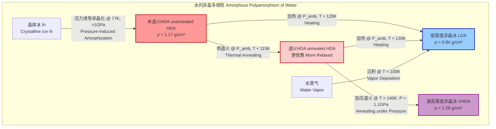

## 未退火的高密度非晶冰 (unannealed HDA)

未退火的高密度非晶冰（unannealed High-Density Amorphous ice）是一种亚稳态的固态水，它缺乏晶体水的长程有序周期性结构。它是在低温下通过对普通冰（冰 Ih）施加高压而形成的一种玻璃态。术语“未退火”特指该材料处于其“初生”或“刚制备”的状态，尚未经过任何热处理。因此，这种状态的非晶冰内部包含了大量的内应力和结构缺陷，使其处于势能面（Potential Energy Landscape, PEL）上的一个较高能量的局部极小值点。对未退火HDA的研究对于理解水的多相性（polyamorphism）、玻璃化转变以及极端条件下的物质行为至关重要。

### 核心概念与数学基础

#### 1. 势能面 (Potential Energy Landscape, PEL)
水的相行为可以通过其势能面来理解。PEL是一个高维曲面，其能量是系统中所有原子坐标的函数。
- **晶体冰 (Crystalline Ice, Ih):** 对应于PEL的全局最小值，代表热力学最稳定的状态。
- **非晶冰 (Amorphous Ice):** 对应于PEL上的众多局部极小值。这些状态是动力学上被捕获的，无法自发转变为晶体态，尤其是在低温下。
- **未退火HDA:** 当通过压力诱导非晶化形成HDA时，系统被困在PEL上一个相对较高能量的局部极小值中。这个状态的能量 $E_{uHDA}$ 较高。
- **退火 (Annealing):** 通过加热，系统获得足够的热能（$k_B T$）以越过小的能垒，弛豫到能量更低的局部极小值，即退火后的HDA（$E_{aHDA}$），其中 $E_{aHDA} < E_{uHDA}$。

#### 2. 结构表征：结构因子与径向分布函数
未退火HDA的无序结构通常通过X射线或中子衍射实验进行表征。实验测得的散射强度可以转换为结构因子 $S(Q)$，它描述了原子在倒易空间中的关联。

结构因子 $S(Q)$ 的数学定义为：
$$ S(Q) = 1 + \frac{N}{V} \int_{0}^{\infty} 4\pi r^2 [g(r) - 1] \frac{\sin(Qr)}{Qr} dr $$
其中：
- $Q$ 是动量转移矢量的大小，单位为 Å⁻¹。
- $N$ 是系统中的原子数。
- $V$ 是系统体积。
- $r$ 是原子间的径向距离。
- $g(r)$ 是径向分布函数。

通过对 $S(Q)$ 进行傅里叶变换，可以得到径向分布函数 $g(r)$，它给出了在给定一个原子的情况下，在距离 $r$ 处找到另一个原子的概率密度。
$$ g(r) = 1 + \frac{1}{2\pi^2 r \rho_0} \int_{0}^{\infty} Q [S(Q) - 1] \sin(Qr) dQ $$
其中：
- $\rho_0 = N/V$ 是系统的平均数密度。

对于未退火HDA，其 $g(r)$ 函数的峰比退火后的HDA或晶体冰更宽，这表明其结构具有更高的无序度。第一个峰对应于水分子的第一近邻（O-O）距离，第二个峰对应于第二近邻。

### 关键技术规格

下表总结了在环境压力和77 K下回收的未退火HDA的典型物理性质。

| 参数 (Parameter) | 典型值 (Typical Value) | 单位 (Unit) | 备注 (Notes) |
| :--- | :--- | :--- | :--- |
| 形成压力 (Formation Pressure) | 1.0 - 1.6 | GPa | 在77 K下对冰Ih进行等温压缩 |
| 形成温度 (Formation Temperature) | 77 | K | 通常使用液氮 |
| 密度 (Density) | 1.17 ± 0.02 | g/cm³ | 在77 K和环境压力下测量 |
| 体积模量 (Bulk Modulus) | ~12 | GPa | 衡量其抗压缩能力 |
| 结构因子第一主峰 (FSDP of S(Q)) | ~2.2 | Å⁻¹ | 表征中程有序性的关键特征 |
| 第一近邻O-O距离 (1st O-O distance) | ~2.8 | Å | 从 $g(r)$ 的第一峰位置确定 |
| HDA→LDA转变温度 (HDA→LDA Transition Temp.) | ~120 | K | 在环境压力下加热时发生 |
| 弛豫焓 (Enthalpy of Relaxation) | ~1.6 | kJ/mol | 在退火过程中释放的热量 |

### 常见用例与性能指标

未退火HDA主要用于基础科学研究，而非工业应用。

*   **研究玻璃态弛豫动力学:**
    *   **用途:** 作为研究玻璃材料结构弛豫的理想模型系统。通过差示扫描量热法（DSC）监测其在加热过程中的焓释放。
    *   **性能指标:** 焓释放速率 $dH/dt$ 作为温度的函数，可以揭示弛豫过程的动力学参数。弛豫过程通常在 80 K 到 115 K 的温度范围内发生。

*   **探索水的液-液相变假说:**
    *   **用途:** HDA被认为是高密度液体（HDL）的玻璃态对应物。研究未退火HDA到低密度非晶冰（LDA）的转变，为水的“第二临界点”假说提供实验证据。
    *   **性能指标:** 该转变具有一级相变的特征，表现为密度急剧下降（从1.17 g/cm³ 降至 0.94 g/cm³）和潜热吸收。转变的锐利程度（转变温度宽度 < 5 K）是衡量其一级相变特征的关键。

*   **天体物理和行星科学模型:**
    *   **用途:** 模拟木卫二、土卫二等冰卫星内部以及彗星中可能存在的高压冰相。
    *   **性能指标:** 未退火HDA的光谱特征（如红外吸收光谱）可与望远镜观测到的天体光谱进行比对，以确定这些天体上非晶冰的存在形式和状态。

### 制备考量

未退火HDA的制备是一个精确控制的物理过程，而非化学合成。

```mermaid
graph TD
    subgraph "未退火HDA的制备流程 Preparation of unannealed HDA"
        A[起始材料: 晶体冰 Ih<br>Initial Material: Crystalline Ice Ih] --> B冷却至77K<br>Cool to 77K;
        B --> C[置于活塞-圆筒装置<br>Place in Piston-Cylinder Apparatus];
        C --> D等温缓慢加压<br>Isothermal Slow Compression;
        D -- "压力 > 1.0 GPa<br>Pressure > 1.0 GPa" --> E[发生压力诱导非晶化<br>Pressure-Induced Amorphization Occurs];
        E --> F[在峰值压力下保持<br>Hold at Peak Pressure];
        F --> G保持低温, 缓慢卸压<br>Maintain Temp, Slow Decompression;
        G -- "压力 -> 环境压力<br>Pressure -> Ambient" --> H[获得未退火HDA样品<br>Recover unannealed HDA sample];
    end

    style A fill:#cde,stroke:#333,stroke-width:2px
    style H fill:#dfd,stroke:#333,stroke-width:2px
    style D fill:#f9f,stroke:#333,stroke-width:2px
```
**过程控制要点:**
- **压缩速率:** 压缩速率必须足够慢（通常 < 0.1 GPa/min），以确保等温条件并避免样品破裂。过快的压缩可能导致不完全的非晶化或样品内部的温度升高。
- **温度稳定性:** 在整个压缩和卸压过程中，必须将温度严格控制在77 K左右，以防止样品发生热退火或向LDA转变。
- **样品完整性:** 卸压后，样品非常脆，必须在液氮温度下进行操作和存储，以防其转变为LDA或重结晶为冰Ic。

### 性能特征

*   **结构:** 未退火HDA的结构因子 $S(Q)$ 的峰比退火后的HDA更宽，振幅更低。这表明其原子排布的无序度更高，键角和键长分布更宽。
*   **热力学:** 它是热力学亚稳态。在差示扫描量热法（DSC）曲线上，当加热未退火HDA时，首先观察到一个宽的放热峰（对应于结构弛豫/退火），随后是一个急剧的吸热峰，标志着向LDA的一级相变。
*   **动力学:** 在低温下（< 80 K），未退火HDA的结构是“冻结”的。随着温度升高，原子开始有足够的迁移能力进行局部重排，导致结构弛豫。该弛豫过程不遵循简单的阿伦尼乌斯行为，表现出典型的玻璃态动力学特征。
*   **统计测量:**
    *   密度分布: 多个独立实验制备的样品密度显示出一定的分布，通常为 $1.17 \pm 0.02$ g/cm³，置信水平为95%。这种变化可能源于制备过程中压力和温度的微小差异。
    *   转变温度: HDA到LDA的转变温度 $T_x$ 也存在统计分布，通常在 $120 \pm 5$ K 范围内，具体取决于加热速率。

### 相关技术与比较模型

未退火HDA是水多种非晶相之一。理解它们的相互关系是研究水异常行为的核心。



**比较数学模型：双液体模型 (Two-Liquid Model)**

该模型假设在过冷水区域存在两种不同结构的液相：低密度液体（LDL）和高密度液体（HDL）。HDA和LDA被认为是这两种液体在玻璃化转变温度以下对应的玻璃态。

它们的吉布斯自由能 $G$ 差异可以描述为：
$$ \Delta G_{HL}(P, T) = G_{HDL}(P, T) - G_{LDL}(P, T) $$
其中 $G_{HDL}$ 和 $G_{LDL}$ 分别是高密度和低密度相的吉布斯自由能。相变发生在 $\Delta G_{HL} = 0$ 的曲线上。压力是决定哪个相更稳定的关键变量：
- **低压下:** LDL更稳定，因此水结冰形成低密度的冰Ih，或玻璃化形成LDA。
- **高压下:** HDL更稳定，因此压力诱导非晶化形成HDA。

未退火HDA可以被看作是系统从高压稳定区（HDL）被快速“淬火”到低压亚稳区的状态，保留了高密度结构的记忆，但处于高度紧张的非平衡状态。

### 参考文献

1.  Mishima, O., Calvert, L. D., & Whalley, E. (1984). An apparently first-order transition between two amorphous phases of ice at a high pressure. *Nature*, 310(5976), 393–395. DOI: [10.1038/310393a0](https://doi.org/10.1038/310393a0)
2.  Loerting, T., & Giovambattista, N. (2006). Amorphous ices: a playground for theory and experiment. *Journal of Physics: Condensed Matter*, 18(50), R919–R977. DOI: [10.1088/0953-8984/18/50/R01](https://doi.org/10.1088/0953-8984/18/50/R01)
3.  Winkel, K., Elsaesser, M. S., Mayer, E., & Loerting, T. (2008). Reversibility and memory of the high-density to low-density amorphous ice transition. *Journal of Chemical Physics*, 128(4), 044510. DOI: [10.1063/1.2823112](https://doi.org/10.1063/1.2823112)