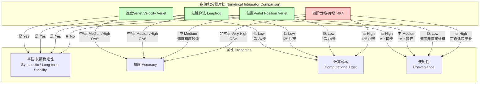

## 速度Verlet算法

速度Verlet算法是一种用于数值积分哈密顿系统（特别是牛顿运动方程）的流行方法。由于其卓越的长期能量守恒性、时间可逆性和计算效率，它在分子动力学（MD）、天体力学和计算机图形学等领域得到了广泛应用。该算法通过一种交错的方式更新位置和速度，实现了精度和稳定性之间的出色平衡。

### 核心概念与数学基础

速度Verlet算法的目标是求解二阶常微分方程（ODE），其形式为牛顿第二定律：
$$ \vec{a}(t) = \frac{d^2\vec{r}(t)}{dt^2} = \frac{\vec{F}(\vec{r}(t))}{m} $$
其中：
*   $\vec{r}(t)$ 是粒子在时间 $t$ 的位置向量。
*   $\vec{v}(t) = d\vec{r}(t)/dt$ 是粒子在时间 $t$ 的速度向量。
*   $\vec{a}(t) = d\vec{v}(t)/dt$ 是粒子在时间 $t$ 的加速度向量。
*   $\vec{F}(\vec{r}(t))$ 是作用在粒子上的力，仅取决于其位置。
*   $m$ 是粒子的质量。

该算法的推导基于位置和速度的泰勒级数展开。

**1. 位置展开:**
将位置向量 $\vec{r}(t)$ 在 $t$ 时刻附近进行泰勒展开至三阶：
$$ \vec{r}(t + \Delta t) = \vec{r}(t) + \vec{v}(t)\Delta t + \frac{1}{2}\vec{a}(t)\Delta t^2 + \frac{1}{6}\frac{d^3\vec{r}}{dt^3}(t)\Delta t^3 + \mathcal{O}(\Delta t^4) $$
其中 $\Delta t$ 是一个微小的时间步长。

**2. 速度展开:**
同样，将速度向量 $\vec{v}(t)$ 在 $t$ 时刻附近进行泰勒展开至二阶：
$$ \vec{v}(t + \Delta t) = \vec{v}(t) + \vec{a}(t)\Delta t + \frac{1}{2}\frac{d\vec{a}}{dt}(t)\Delta t^2 + \mathcal{O}(\Delta t^3) $$

**3. 算法推导:**
速度Verlet算法采用以下两步更新方案：

**第一步：更新位置**
直接截断位置的泰勒展开式，忽略 $\mathcal{O}(\Delta t^3)$ 及更高阶项，得到位置的更新方程。这一步的局部截断误差为 $\mathcal{O}(\Delta t^3)$，但由于对称性，全局误差为 $\mathcal{O}(\Delta t^2)$。
$$ \vec{r}(t + \Delta t) = \vec{r}(t) + \vec{v}(t)\Delta t + \frac{1}{2}\vec{a}(t)\Delta t^2 $$

**第二步：更新速度**
速度的更新采用一种巧妙的平均加速度方案。首先，使用新计算出的位置 $\vec{r}(t + \Delta t)$ 来计算新的加速度 $\vec{a}(t + \Delta t) = \vec{F}(\vec{r}(t + \Delta t))/m$。然后，使用当前和未来加速度的算术平均值来更新速度：
$$ \vec{v}(t + \Delta t) = \vec{v}(t) + \frac{\vec{a}(t) + \vec{a}(t + \Delta t)}{2} \Delta t $$
这个形式可以通过重新整理速度的泰勒展开式得到，它有效地包含了 $\frac{d\vec{a}}{dt}$ 项的一阶近似，从而将速度的局部误差也控制在 $\mathcal{O}(\Delta t^3)$。

**核心特性:**
*   **辛性 (Symplecticity):** 该算法不直接守恒系统的哈密顿量（总能量），但它精确地守恒一个与原始哈密顿量非常接近的“影子哈密顿量”。这导致总能量在一个恒定值附近有界振荡，而不会出现长期漂移。这是其在长期模拟中保持稳定性的关键。
*   **时间可逆性 (Time-Reversibility):** 如果将时间步长 $\Delta t$ 反向（即变为 $-\Delta t$），并反转速度，算法可以精确地沿原轨迹返回。这个特性有助于减少误差的累积。
*   **计算效率:** 每个时间步只需要进行一次力计算，使其计算成本相对较低。

### 关键技术规格

下表总结了速度Verlet算法的关键技术属性。

| 参数 (Parameter) | 描述 (Description) | 典型值/属性 (Typical Value/Property) |
| :--- | :--- | :--- |
| 积分器类型 (Integrator Type) | 用于常微分方程的数值积分器 | 辛积分器 (Symplectic), 时间可逆 (Time-Reversible) |
| 位置局部截断误差 | 单步位置计算的误差 | $\mathcal{O}(\Delta t^3)$ |
| 位置全局误差 | 累积的位置误差 | $\mathcal{O}(\Delta t^2)$ |
| 速度局部截断误差 | 单步速度计算的误差 | $\mathcal{O}(\Delta t^3)$ |
| 速度全局误差 | 累积的速度误差 | $\mathcal{O}(\Delta t^2)$ |
| 能量守恒性 | 长期模拟中的总能量漂移特性 | 能量有界波动，无长期（系统性）漂移 |
| 典型时间步长 $\Delta t$ | 在分子动力学模拟中的应用 | 1-10 飞秒 (fs), 即 $10^{-15}$ s 至 $10^{-14}$ s |
| 内存需求 | 每个粒子所需的存储 | 位置 $\vec{r}$, 速度 $\vec{v}$, 加速度 $\vec{a}$ (3个向量) |

### 常见用例

速度Verlet算法因其鲁棒性和效率而被广泛应用于多个科学和工程领域。

*   **分子动力学 (Molecular Dynamics, MD):**
    *   **应用:** 模拟蛋白质折叠、药物设计、液体性质研究、材料科学中的原子行为。
    *   **性能指标:** 能够稳定模拟包含 $10^3$ 到 $10^7$ 个原子的系统，模拟时间尺度可从皮秒 (ps) 延伸至微秒 (μs)。总能量的标准差与平均能量之比通常小于 $10^{-4}$。

*   **天体力学 (Celestial Mechanics):**
    *   **应用:** 模拟行星、恒星和星系的N体引力相互作用。
    *   **性能指标:** 能够在数百万年的模拟时间内保持行星轨道的长期稳定性，避免了非辛方法中常见的轨道衰变或逃逸问题。

*   **计算机图形学与物理引擎 (Computer Graphics & Physics Engines):**
    *   **应用:** 实时模拟布料、流体、绳索和刚体的物理行为。
    *   **性能指标:** 能够在消费级硬件上对中等复杂度的场景（数千个交互粒子）实现实时计算（通常 > 30 FPS），同时保持视觉上的物理真实感。

### 实现考量

#### 算法流程

以下是速度Verlet算法在一个典型模拟循环中的实现步骤。

```mermaid
graph TD
    A["开始 Start<br>t=0, r0, v0"] --> B["计算初始力<br>Fr0 -> a0[";
    B --> C["进入主循环 Main Loop[";
    C --> D["步骤 1: 更新位置<br>rt + Δt = rt + vtΔt + 0.5atΔt²"];
    D --> E["步骤 2: 计算新力<br>基于 rt + Δt 计算 F_new, a_new"];
    E --> F["步骤 3: 更新速度<br>vt + Δt = vt + 0.5at + a_newΔt"];
    F --> G["更新状态以备下一循环<br>vt <-- vt + Δt<br>at <-- a_new<br>t <-- t + Δt"];
    G --> H["继续模拟? Continue?[";
    H -- 是 Yes --> D;
    H -- 否 No --> I["结束 End"];

    style D fill:#cde,stroke:#333,stroke-width:2px
    style E fill:#fde,stroke:#333,stroke-width:2px
    style F fill:#ced,stroke:#333,stroke-width:2px
```

#### 算法复杂度分析

*   **积分器更新:** 对于一个包含 $N$ 个粒子的系统，更新所有粒子的位置和速度的计算复杂度为 $\mathcal{O}(N)$。
*   **力计算:** 这是每个时间步中最耗费计算资源的部分。
    *   对于考虑所有粒子间相互作用的朴素实现，复杂度为 $\mathcal{O}(N^2)$。
    *   通过使用截断半径和邻居列表 (Neighbor Lists) 等优化技术，可以将其降低到接近 $\mathcal{O}(N)$。
    *   对于长程力（如静电力），通常使用粒子网格Ewald (PME) 等方法，其复杂度为 $\mathcal{O}(N \log N)$。
*   **总体复杂度:** 每个时间步的总体复杂度由力计算主导。速度Verlet算法本身的开销极小。

### 性能特征

*   **能量守恒:** 速度Verlet算法的标志性特征是其出色的能量守恒性。总能量 $E_{tot} = K + U$（动能+势能）的波动幅度与时间步长的平方成正比，即 $\delta E / E \propto \Delta t^2$。在长时间模拟中，平均能量保持恒定，没有系统性漂移。相比之下，非辛方法（如标准的龙格-库塔法）会导致能量随时间线性漂移。
*   **相空间体积守恒:** 作为一种辛积分器，它近似地保持了相空间的体积。根据刘维尔定理，真实的哈密顿动力学是保相体积的。速度Verlet算法的这一特性是其长期稳定性的根本原因。
*   **稳定性:** 算法的数值稳定性取决于时间步长 $\Delta t$ 的选择。$\Delta t$ 必须足够小，以解析系统中最高频率的运动（例如，化学键的振动）。通常，$\Delta t$ 应小于最快振动周期的1/10。如果 $\Delta t$ 过大，模拟将变得不稳定，能量会迅速发散。

### 相关技术对比

速度Verlet算法是几何积分器家族的一员。了解其与相关算法的异同至关重要。



#### 数学模型比较

*   **位置Verlet算法 (Position Verlet)**
    这是最初的Verlet形式，它不显式地计算速度：
    $$ \vec{r}(t + \Delta t) = 2\vec{r}(t) - \vec{r}(t - \Delta t) + \vec{a}(t) \Delta t^2 $$
    速度必须通过中心差分间接计算，$\vec{v}(t) = [\vec{r}(t + \Delta t) - \vec{r}(t - \Delta t)] / (2\Delta t)$，这导致精度较低，并且在需要精确动能的场合（如温度耦合）会带来不便。

*   **蛙跳算法 (Leapfrog Integrator)**
    蛙跳算法在数学上与速度Verlet等价，但其形式不同：
    $$ \vec{v}(t + \Delta t/2) = \vec{v}(t - \Delta t/2) + \vec{a}(t) \Delta t $$
    $$ \vec{r}(t + \Delta t) = \vec{r}(t) + \vec{v}(t + \Delta t/2) \Delta t $$
    速度的计算时间点位于两个位置时间点的中间（$t \pm \Delta t/2$），而位置的计算时间点在整数步长上（$t, t+\Delta t$）。这种时间上的交错（“蛙跳”）是其名称的由来。虽然稳定性和精度与速度Verlet相同，但位置和速度不同步给计算总能量带来了不便。

*   **四阶龙格-库塔法 (RK4)**
    RK4是一种高阶通用ODE求解器，其全局误差为 $\mathcal{O}(\Delta t^4)$。它通过在每个时间步内进行四次力（或导数）的计算来达到高精度。然而，RK4不是辛方法，因此在保守系统的长期模拟中会出现能量漂移。其高昂的计算成本（每个时间步4次力计算）和缺乏长期稳定性使其不适用于典型的分子动力学模拟，但非常适合需要高精度的短期轨迹计算。

### 参考文献

1.  Verlet, L. (1967). Computer 'Experiments' on Classical Fluids. I. Thermodynamical Properties of Lennard-Jones Molecules. *Physical Review*, 159(1), 98–103. [DOI: 10.1103/PhysRev.159.98](https://doi.org/10.1103/PhysRev.159.98)
2.  Swope, W. C., Andersen, H. C., Berens, P. H., & Wilson, K. R. (1982). A computer simulation method for the calculation of equilibrium constants for the formation of physical clusters of molecules: Application to small water clusters. *The Journal of Chemical Physics*, 76(1), 637–649. [DOI: 10.1063/1.442716](https://doi.org/10.1063/1.442716) (This paper popularized the velocity Verlet form).
3.  Frenkel, D., & Smit, B. (2002). *Understanding Molecular Simulation: From Algorithms to Applications*. Academic Press.
4.  Allen, M. P., & Tildesley, D. J. (2017). *Computer Simulation of Liquids* (2nd ed.). Oxford University Press.