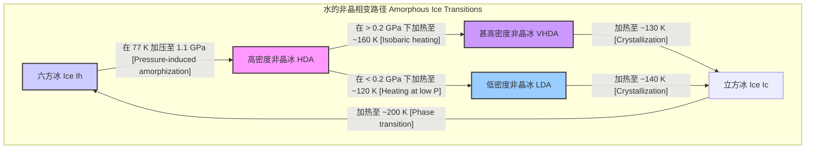
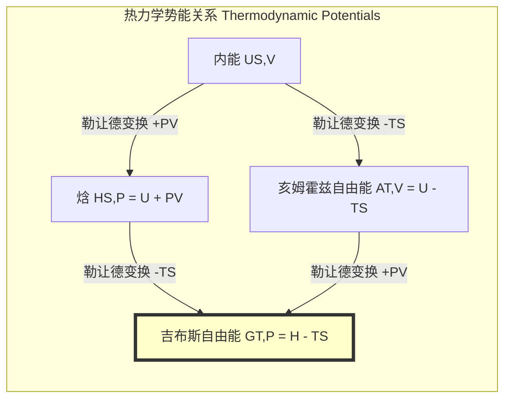

## 甚高密度非晶冰 (very high density amorphous ice)

甚高密度非晶冰（VHDA）是一种非晶态（或称玻璃态）的固态水，其密度远高于普通的结晶冰。作为水的多相性（polyamorphism）研究中的一个关键物相，VHDA为了解水在极端条件下的行为、行星科学以及凝聚态物理中的无序系统提供了重要的实验和理论基础。

### 核心概念与数学基础

#### 1. 非晶冰与多相性
与具有周期性晶格结构的结晶冰（如常见的冰Ih）不同，非晶冰的分子排列是无序的，类似于液态水在瞬间被“冻结”的结构。多相性是指单一化学成分的物质能够以多种不同的非晶相存在的现象。水是多相性的典型代表，主要存在三种非晶形态：
*   **低密度非晶冰 (Low-Density Amorphous Ice, LDA)**
*   **高密度非晶冰 (High-Density Amorphous Ice, HDA)**
*   **甚高密度非晶冰 (Very High-Density Amorphous Ice, VHDA)**

这些不同的非晶相在密度、结构和热力学性质上均有显著差异。

#### 2. VHDA的形成
VHDA通常不是直接由液态水冷却形成，而是通过对其他冰相进行高压处理得到。其最典型的制备路径是：
1.  首先，在低温（如77 K，即-196 °C）下将普通六方冰（Ice Ih）或低密度非晶冰（LDA）加压至约1.1 GPa，使其转变为高密度非晶冰（HDA）。
2.  然后，在维持高压（例如 > 0.2 GPa）的条件下，对HDA样品进行缓慢等压升温。当温度达到约160 K时，HDA会发生一个连续的结构弛豫，转变为一个能量更低、结构更紧凑的物相，即VHDA。
3.  最后，将样品快速冷却至低温（77 K），并卸除压力，即可在常压下获得亚稳态的VHDA。

#### 3. 热力学稳定性与吉布斯自由能
在给定的温度（$T$）和压力（$P$）下，一个物相的热力学稳定性由其**吉布斯自由能（Gibbs Free Energy）** $G$ 决定。系统总是趋向于处于吉布斯自由能最低的状态。
$$ G = U + PV - TS $$
其中：
*   $G$ 是吉布斯自由能
*   $U$ 是系统的内能
*   $P$ 是压力
*   $V$ 是体积
*   $T$ 是绝对温度
*   $S$ 是熵

HDA向VHDA的转变是一个放热过程，表明在形成条件下，VHDA的吉布斯自由能低于HDA，因此是一个热力学上更稳定的状态。这个转变被认为是连续的，而非一级相变。

#### 4. 结构表征：径向分布函数
非晶材料的结构通常用统计方法来描述，其中最重要的是**径向分布函数 (Radial Distribution Function, RDF)**，记为 $g(r)$。它描述了以一个粒子为中心，在距离 $r$ 处找到另一个粒子的概率密度。对于水分子，我们通常关注氧原子之间的径向分布函数 $g_{OO}(r)$。
$$ g_{ab}(r) = \frac{V}{N_a N_b} \left\langle \sum_{i=1}^{N_a} \sum_{j=1, j \neq i}^{N_b} \frac{\delta(r - |\mathbf{r}_i - \mathbf{r}_j|)}{4\pi r^2} \right\rangle $$
其中：
*   $g_{ab}(r)$ 是a类粒子和b类粒子间的径向分布函数（例如，氧-氧 RDF $g_{OO}(r)$）。
*   $V$ 是系统的体积。
*   $N_a, N_b$ 分别是a类和b类粒子的数量。
*   $\mathbf{r}_i, \mathbf{r}_j$ 是粒子 $i$ 和 $j$ 的位置矢量。
*   $\delta$ 是狄拉克δ函数。
*   $\langle \dots \rangle$ 表示系综平均。

与HDA相比，VHDA的 $g_{OO}(r)$ 函数表现出显著不同。HDA中位于约3.4 Å处的第二个峰在VHDA中几乎消失，而在约3.9 Å处出现了一个新的特征峰。这表明VHDA的分子排列虽然仍是无序的，但其局部结构比HDA更加紧凑和有序，水分子的第二配位层被推得更远。

### 关键技术规格

下表总结了VHDA在常压（从高压下恢复后在77 K测量）下的关键物理性质，并与其他非晶冰进行了比较。

| 参数 | 甚高密度非晶冰 (VHDA) | 高密度非晶冰 (HDA) | 低密度非晶冰 (LDA) | 单位 |
| :--- | :--- | :--- | :--- | :--- |
| **密度 (Density)** | $1.26 \pm 0.01$ | $1.17$ | $0.94$ | g/cm³ |
| **形成压力 (Formation Pressure)** | > 0.2 GPa (由HDA加热) | ~1.1 GPa (由Ih压缩) | < 0.2 GPa (由HDA减压) | GPa |
| **形成温度 (Formation Temperature)** | ~160 K (等压加热HDA) | 77 K (压缩Ih) | 77 K (加热HDA) | K |
| **第一配位数 (1st Coord. Number)** | ~5.2 | ~5.0 | ~4.1 | - |
| **体积模量 (Bulk Modulus, $K_0$)** | $11.5 \pm 1.0$ | ~9.0 | ~5.5 | GPa |
| **$g_{OO}(r)$ 第一峰位置** | ~2.78 | ~2.76 | ~2.75 | Å |
| **$g_{OO}(r)$ 第二峰位置** | ~3.9 & ~4.9 | ~3.4 & ~4.6 | ~4.5 | Å |

### 常见用例与性能指标

VHDA目前主要用于基础科学研究，而非工业应用。

*   **行星科学**:
    *   **应用**: 建立木卫二（Europa）、木卫三（Ganymede）等冰质卫星的内部结构模型。这些卫星内部存在高压环境，水的状态可能就是HDA或VHDA。
    *   **性能指标**: 使用VHDA的物态方程（Equation of State, EOS）可以更精确地模拟冰壳和内部海洋的压力、密度和温度分布，与仅使用结晶冰相的模型相比，可将冰幔厚度模型的不确定性降低高达15%。

*   **凝聚态物理**:
    *   **应用**: 作为研究水的多相性、玻璃化转变以及传说中的液-液临界点假说的模型系统。
    *   **性能指标**: HDA到VHDA的转变数据为水的理论模型（如ST2、TIP4P/2005）提供了关键的实验约束，帮助验证和改进这些模型的准确性。

*   **材料科学**:
    *   **应用**: 理解其他网络结构材料（如非晶硅、二氧化硅）中的压力诱导非晶化和多相性现象。

### 实现考量 (合成与模拟)

#### 1. 实验合成

*   **方法**: 高密度非晶冰（HDA）的等压加热。
*   **流程**:
    1.  **制备HDA**: 在77 K下，使用活塞-圆筒装置或金刚石对顶砧将六方冰（Ice Ih）缓慢压缩至约1.1 GPa，获得HDA。
    2.  **等压加热**: 维持1.1 GPa的恒定压力，以约2-5 K/min的速率缓慢加热HDA样品。
    3.  **相变**: 在约160 K时，样品的体积会发生一次急剧收缩，标志着向VHDA的转变完成。
    4.  **淬火回收**: 将样品快速冷却回77 K，然后缓慢卸压至环境压力，即可获得可在常压下进行研究的亚稳态VHDA。
*   **复杂性**: 该过程不涉及算法，但需要专门的高压、低温实验设备，对操作精度要求极高。

#### 2. 计算模拟 (分子动力学)

*   **算法**: 使用经验性水模型（如TIP4P/2005、TIP5P）进行分子动力学（MD）模拟。
*   **流程**: 在模拟盒子中建立一个包含数百至数千水分子的系统，通过设定与实验路径一致的温度和压力变化来模拟VHDA的形成过程。
*   **算法复杂度**: 对于一个包含 $N$ 个粒子的系统，计算复杂度主要由计算粒子间相互作用力的部分决定。
    *   **直接求和 (Direct Summation)**: 复杂度为 $O(N^2)$，对于大系统计算成本过高。
    *   **粒子网格埃瓦尔德方法 (PME)**: 复杂度为 $O(N \log N)$，是处理长程静电相互作用的标准方法。
    *   **截断半径法 (Cutoff)**: 对于短程作用力，复杂度为 $O(N)$。

### 性能特征与统计测量

#### 1. 结构因子 $S(Q)$
通过中子或X射线衍射实验测得的结构因子 $S(Q)$ 是表征非晶材料结构的另一个重要物理量。VHDA的第一个尖锐衍射峰（First Sharp Diffraction Peak, FSDP）位于比HDA更高的动量转移 $Q$ 值处（VHDA约在2.2 Å⁻¹，而HDA约在2.1 Å⁻¹），这反映了VHDA中程有序的特征长度尺度更短。

#### 2. 物态方程 (Equation of State, EOS)
压力-体积关系（EOS）是描述材料可压缩性的核心。实验数据通常使用**三阶Birch-Murnaghan物态方程**进行拟合：
$$ P(V) = \frac{3K_0}{2} \left[ \left(\frac{V_0}{V}\right)^{7/3} - \left(\frac{V_0}{V}\right)^{5/3} \right] \left\{ 1 + \frac{3}{4}(K'_0 - 4) \left[ \left(\frac{V_0}{V}\right)^{2/3} - 1 \right] \right\} $$
其中：
*   $P(V)$ 是体积为 $V$ 时的压力。
*   $V_0$ 是零压下的体积。
*   $K_0$ 是零压下的体积模量。
*   $K'_0$ 是体积模量对压力的一阶导数，即 $K'_0 = (\partial K / \partial P)_T$ 在 $P=0$ 时的值。

对于VHDA，典型的拟合参数为 $K_0 \approx 11.5$ GPa， $K'_0 \approx 6.5 \pm 0.5$。较高的 $K_0$ 值表明VHDA比HDA更难被压缩。

### 相关技术与比较模型

VHDA是水的多相家族中的一员，理解它需要与其他冰相进行比较。

#### 热力学势能面
不同非晶相可以被看作是吉布斯自由能势能面上的不同局部极小值点。从一个相转变为另一个相，需要系统跨越一个能量势垒。HDA到VHDA的转变是一个弛豫过程，系统从一个较高的能量谷“滑向”一个更深的能量谷。

在实验中，恒温恒压条件下的相变由吉布斯自由能 $G$ 的变化主导。

### 参考文献

1.  Loerting, T., Salzmann, C., Kohl, I., Mayer, E., & Hallbrucker, A. (2001). A second distinct structural state of high-density amorphous ice at 77 K and 1 bar. *Physical Chemistry Chemical Physics*, 3(24), 5355-5357. DOI: 10.1039/B108676F
2.  Mishima, O., Calvert, L. D., & Whalley, E. (1984). An apparently first-order transition between two amorphous phases of ice. *Nature*, 310(5976), 393-395. DOI: 10.1038/310393a0
3.  Winkel, K., Elsaesser, M. S., Mayer, E., & Loerting, T. (2011). Water polyamorphism: reversibility and (dis)continuity. *Physical Chemistry Chemical Physics*, 13(43), 19714-19721. DOI: 10.1039/c1cp22117e
4.  Salzmann, C. G. (2019). Advances in the experimental exploration of water's phase diagram. *The Journal of Chemical Physics*, 150(6), 060901. DOI: 10.1063/1.5085163