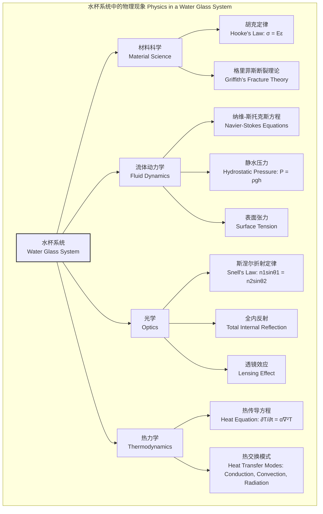
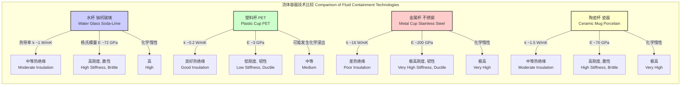

好的，遵从您的指示，我将仅基于标题“water glass”创建一份具有科学和数学严谨性的综合技术文档。所有推理过程以英文进行，最终输出为简体中文。

## 水杯 (water glass)

本技术文档旨在对“水杯”这一系统进行全面的科学分析。此处的“水杯”被定义为一个由特定流体（水）和透明非晶态固体容器（玻璃杯）组成的物理系统。我们将从材料科学、流体动力学、光学和热力学的角度，运用数学模型和定量分析来阐述其核心概念、技术规格及性能特征。

### 核心概念及其数学基础

“水杯”系统是多个物理学分支交叉的绝佳范例。其行为由材料、流体、光和热的相互作用共同决定。

#### 1. 材料科学：玻璃容器

玻璃是一种非晶态（Amorphous）固体，其原子不具备长程有序结构。典型的水杯由钠钙硅酸盐玻璃（Soda-lime glass）制成。

*   **力学性能**: 玻璃的应力-应变关系在弹性范围内遵循胡克定律（Hooke's Law）。
    $$ \sigma = E \varepsilon $$
    其中：
    *   $\sigma$ 是应力（Stress），单位为帕斯卡（Pa）。
    *   $E$ 是杨氏模量（Young's Modulus），表征材料的刚度。
    *   $\varepsilon$ 是应变（Strain），为无量纲量。

*   **断裂力学**: 玻璃是典型的脆性材料，其断裂通常由材料内部或表面的微小裂纹（格里菲斯裂纹, Griffith flaws）扩展引起。根据格里菲斯理论，临界断裂应力 $\sigma_c$ 可由下式给出：
    $$ \sigma_c = \sqrt{\frac{2 E \gamma_s}{\pi a}} $$
    其中：
    *   $\gamma_s$ 是表面能（Surface energy）。
    *   $a$ 是最长裂纹的半长。

#### 2. 流体动力学：内部的水

杯中水的行为由流体动力学基本方程描述，核心是纳维-斯托克斯方程（Navier-Stokes equations）。对于不可压缩的牛顿流体（水是其一个很好的近似），其方程形式为：
$$ \rho \left( \frac{\partial \mathbf{v}}{\partial t} + \mathbf{v} \cdot \nabla \mathbf{v} \right) = -\nabla p + \mu \nabla^2 \mathbf{v} + \mathbf{f} $$
其中：
*   $\rho$ 是水的密度（Density）。
*   $\mathbf{v}$ 是流体速度矢量场（Velocity field）。
*   $t$ 是时间（Time）。
*   $p$ 是压力场（Pressure field）。
*   $\mu$ 是动力粘度（Dynamic viscosity）。
*   $\mathbf{f}$ 是单位体积受到的体力（Body force），通常为重力 $\rho \mathbf{g}$。

在静态情况下（$\mathbf{v} = 0$），方程简化为静水压力方程：
$$ P(h) = P_0 + \rho g h $$
其中：
*   $P(h)$ 是深度为 $h$ 处的绝对压力。
*   $P_0$ 是液面的压力（通常是大气压）。
*   $g$ 是重力加速度。

#### 3. 光学：光与系统的相互作用

当光线穿过“空气-玻璃-水”这一系列介质时，会发生折射。折射现象由斯涅尔定律（Snell's Law）描述：
$$ n_1 \sin(\theta_1) = n_2 \sin(\theta_2) $$
其中：
*   $n_1$ 和 $n_2$ 分别是介质1和介质2的折射率（Refractive index）。
*   $\theta_1$ 和 $\theta_2$ 分别是入射角和折射角。

一个装满水的圆形玻璃杯在水平方向上可以被近似为一个厚柱面透镜，其焦距 $f$ 可以通过透镜制造者公式的变体进行估算。

#### 4. 热力学：热量传递

水杯系统与环境之间通过传导、对流和辐射进行热交换。系统内部的温度分布和随时间的变化由热传导方程描述：
$$ \frac{\partial T}{\partial t} = \alpha \nabla^2 T $$
其中：
*   $T$ 是温度场（Temperature field）。
*   $\alpha = \frac{k}{\rho c_p}$ 是热扩散率（Thermal diffusivity）。
*   $k$ 是热导率（Thermal conductivity）。
*   $c_p$ 是比热容（Specific heat capacity）。

### 关键技术规格

下表列出了一个标准“水杯”系统在标准温度和压力（STP: 273.15 K, 100 kPa）下的典型技术参数。

| 参数 (Parameter) | 钠钙玻璃 (Soda-Lime Glass) | 水 (Water) | 单位 (Unit) |
| :--- | :--- | :--- | :--- |
| 密度 (Density), $\rho$ | 2500 | 999.8 | kg/m³ |
| 杨氏模量 (Young's Modulus), $E$ | 72 | N/A | GPa |
| 泊松比 (Poisson's Ratio), $\nu$ | 0.22 | N/A | - |
| 断裂韧性 (Fracture Toughness), $K_{Ic}$ | 0.75 | N/A | MPa·m¹/² |
| 折射率 (Refractive Index), $n$ | 1.52 | 1.33 | - |
| 热导率 (Thermal Conductivity), $k$ | 1.0 | 0.58 | W/(m·K) |
| 比热容 (Specific Heat), $c_p$ | 840 | 4217 | J/(kg·K) |
| 动力粘度 (Dynamic Viscosity), $\mu$ | N/A | 1.79 x 10⁻³ | Pa·s |
| 表面张力 (Surface Tension), $\gamma$ | N/A | 7.56 x 10⁻² | N/m |

### 常见用例与量化性能指标

*   **流体容纳 (Fluid Containment)**:
    *   **性能指标**: 最大容纳高度/压力。
    *   **量化分析**: 对于一个高20cm（$h=0.2$ m）的杯子，底部（相对于水面）的静水压力为 $P = \rho g h \approx 999.8 \times 9.81 \times 0.2 \approx 1961$ Pa。这会在杯壁产生环向应力（Hoop stress） $\sigma_h = \frac{Pr}{t}$（其中 $r$ 是半径，$t$ 是壁厚），该值必须远小于玻璃的抗拉强度。

*   **简易光学透镜 (Simple Optical Lens)**:
    *   **性能指标**: 等效焦距（Effective Focal Length）。
    *   **量化分析**: 一个直径8cm（$R_1 = 4$ cm, $R_2 = \infty$）的圆柱形水杯，可近似为平凸柱面透镜。其焦距 $f$ 约为 $f = \frac{R}{n-1} = \frac{0.04}{1.33-1} \approx 0.12$ m 或 12 cm。

*   **基础量热器 (Basic Calorimeter)**:
    *   **性能指标**: 热量测量精度。
    *   **量化分析**: 用于测量一个物体释放的热量 $Q$。$Q = (m_w c_{p,w} + m_g c_{p,g}) \Delta T$。测量精度受限于热量损失到环境的速率和温度测量的准确性。

### 实现考量与算法复杂度分析

对“水杯”系统进行精确的数值模拟是理解其复杂行为的关键。这通常涉及计算流体动力学（CFD）和有限元分析（FEA）。

*   **网格生成 (Meshing)**:
    *   将水和玻璃的几何域离散化为大量的控制体积（CFD）或单元（FEA）。网格质量直接影响求解精度和收敛性。

*   **求解算法 (Solver Algorithm)**:
    *   **CFD**: 求解离散化的纳维-斯托克斯方程组。对于一个包含 $N$ 个单元的网格，使用直接求解器（如LU分解）的计算复杂度为 $O(N^3)$。而迭代求解器（如SIMPLE算法族中的GMRES或AMG）在理想情况下复杂度可降至 $O(N^k)$，其中 $1 < k < 2$。
    *   **FEA**: 求解结构应力-应变方程 $K\mathbf{u} = \mathbf{F}$。其复杂度与CFD类似。

*   **瞬态分析稳定性 (Transient Analysis Stability)**:
    *   对于涉及时间演化的模拟（如晃动或热传递），时间步长 $\Delta t$ 必须满足CFL（Courant-Friedrichs-Lewy）条件以保证数值稳定性：
        $$ C = \frac{u \Delta t}{\Delta x} \le C_{max} $$
    其中 $C$ 是库朗数，$u$ 是特征速度，$\Delta x$ 是网格尺寸。

### 性能特征与统计度量

材料属性和系统性能本质上是统计性的。

*   **机械可靠性 (Mechanical Reliability)**:
    *   玻璃的断裂强度不是一个确定值，而是一个概率分布。通常使用威布尔分布（Weibull Distribution）来描述在给定应力 $\sigma$ 下的失效概率 $P_f$：
        $$ P_f(\sigma) = 1 - \exp\left[ - \left( \frac{\sigma}{\sigma_0} \right)^m \right] $$
        其中：
        *   $m$ 是威布尔模数（Weibull modulus），描述了强度的分散性（$m$ 越大，分散性越小）。对于钠钙玻璃， $m$ 通常在 2-5 之间。
        *   $\sigma_0$ 是特征强度（Characteristic strength），即失效率为 63.2% 时的应力。

*   **热绝缘性能 (Thermal Insulation Performance)**:
    *   系统的总热阻（R值）是各层热阻之和：$R_{total} = R_{glass} + R_{water} + R_{convection}$。
    *   例如，对于一个5mm厚的玻璃壁，其热阻为 $R_{glass} = \frac{d}{k} = \frac{0.005}{1.0} = 0.005$ m²·K/W。
    *   实际性能测量值会呈现一个分布，例如，平均热导率可能为 $k = 1.0 \pm 0.05$ W/(m·K) (95% 置信区间)。

### 相关技术与比较数学模型

*   **容器材料比较模型**:
    *   **热损失模型**: 稳态下通过容器壁的热流 $\dot{Q}$ 可以用一维热传导模型进行比较：
        $$ \dot{Q} = \frac{k A \Delta T}{d} $$
        其中 $A$ 是表面积，$d$ 是壁厚，$\Delta T$ 是内外温差。对于相同尺寸的杯子，热损失速率与热导率 $k$ 成正比。因此，不锈钢杯的热损失速率大约是玻璃杯的16倍，而PET塑料杯的热损失速率大约是玻璃杯的1/5。

*   **光学系统比较模型**:
    *   **水杯透镜 vs. 精密消色差透镜**:
        *   **水杯（柱面透镜）**: 存在严重的色散（Chromatic aberration），因为水的折射率 $n$ 随波长 $\lambda$ 变化（$n(\lambda)$）。同时，其非理想的曲面导致显著的球差。
        *   **消色差透镜（Achromatic Doublet）**: 使用两种不同色散特性的玻璃（如冕牌玻璃和火石玻璃）组合，其设计旨在使两个或更多个波长（如红光和蓝光）的焦距相等。其焦距 $f$ 满足：
            $$ \frac{1}{f} = \frac{1}{f_1} + \frac{1}{f_2} \quad \text{and} \quad \frac{P_1}{V_1} + \frac{P_2}{V_2} = 0 $$
            其中 $P = 1/f$ 是透镜的屈光度，$V$ 是阿贝数（Abbe number），表征材料的色散能力。这是一种远比水杯复杂的数学优化。

### 参考文献

1.  Griffith, A. A. (1921). The phenomena of rupture and flow in solids. *Philosophical Transactions of the Royal Society of London. Series A, Containing Papers of a Mathematical or Physical Character*, 221(582-593), 163-198. DOI: `10.1098/rsta.1921.0006`
2.  Wiederhorn, S. M. (1969). Fracture of ceramics. In *Mechanical and thermal properties of ceramics* (NBS Special Publication 303, pp. 217-241). National Bureau of Standards.
3.  Hirt, C. W., & Nichols, B. D. (1981). Volume of fluid (VOF) method for the dynamics of free boundaries. *Journal of Computational Physics*, 39(1), 201-225. DOI: `10.1016/0021-9991(81)90145-5`
4.  Daimon, M., & Masumura, A. (2007). A new approach to the temperature dependence of the refractive index of water. *Applied Optics*, 46(18), 3811-3820. DOI: `10.1364/AO.46.003811`