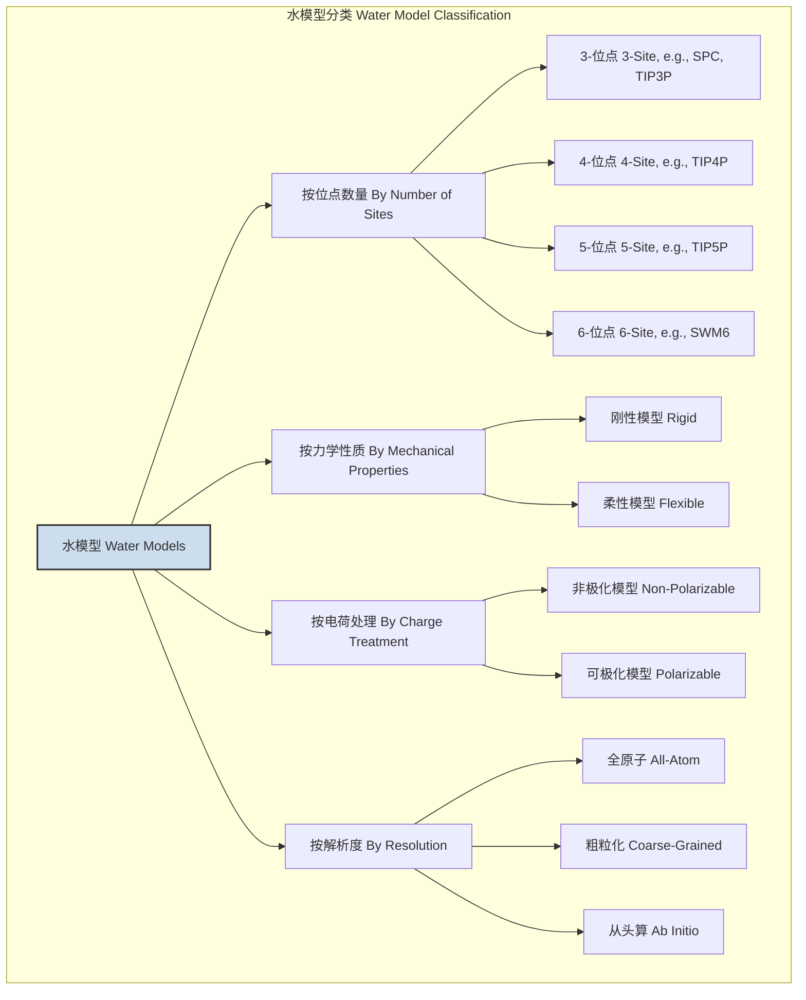
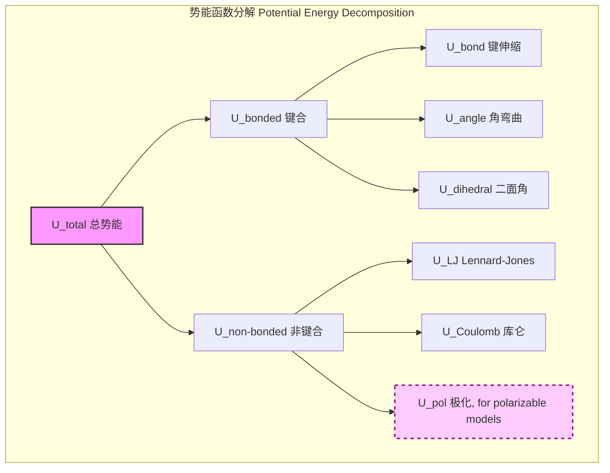

## 水模型 (Water Model)

水模型是在计算化学、计算生物学和物理学中用于分子动力学 (MD) 和蒙特卡洛 (MC) 模拟的数学模型。由于水在化学和生物过程中无处不在，准确地模拟其行为至关重要。水模型旨在以计算上可行的成本，精确再现真实水的物理和化学性质。这些模型通过一个势能函数 (Potential Energy Function) 来描述水分子之间的相互作用。

### 核心概念与数学基础

水模型的核心是其力场 (Force Field)，即一个定义了系统势能 $U$ 如何依赖于其所有原子坐标 $\mathbf{r}$ 的数学函数。系统的总势能通常分为两部分：键合相互作用 ($U_{\text{bonded}}$) 和非键合相互作用 ($U_{\text{non-bonded}}$)。

$$
U_{\text{total}}(\mathbf{r}^N) = U_{\text{bonded}} + U_{\text{non-bonded}}
$$

其中 $\mathbf{r}^N$ 代表系统中 $N$ 个原子的三维坐标集合。

#### 1. 键合相互作用 (Bonded Interactions)
对于**柔性 (flexible)**水模型，键合项描述了单个水分子内部的能量。对于**刚性 (rigid)**模型，这些项被假定为常数（键长和键角固定），因此在力计算中被忽略，从而显著提高了计算效率。

*   **键伸缩 (Bond Stretching):** 通常用谐波势来描述原子间共价键的振动。
    $$
    U_{\text{bond}} = \sum_{\text{bonds}} \frac{1}{2} k_b (r - r_0)^2
    $$
    -   $k_b$: 键伸缩的力常数 (单位: kJ·mol⁻¹·Å⁻²)。
    -   $r$: 两个成键原子之间的瞬时距离 (单位: Å)。
    -   $r_0$: 平衡键长 (单位: Å)。

*   **角弯曲 (Angle Bending):** 描述了三个原子形成的键角的振动。
    $$
    U_{\text{angle}} = \sum_{\text{angles}} \frac{1}{2} k_{\theta} (\theta - \theta_0)^2
    $$
    -   $k_{\theta}$: 角弯曲的力常数 (单位: kJ·mol⁻¹·rad⁻²)。
    -   $\theta$: 三个原子形成的瞬时键角 (单位: rad 或 degree)。
    -   $\theta_0$: 平衡键角 (单位: rad 或 degree)。

#### 2. 非键合相互作用 (Non-bonded Interactions)
非键合相互作用描述了不直接通过共价键连接的原子对之间的相互作用，包括不同水分子之间的作用。这是模拟液体水宏观性质的关键。

$$
U_{\text{non-bonded}} = \sum_{i<j} \left( U_{\text{LJ}}(r_{ij}) + U_{\text{Coulomb}}(r_{ij}) \right)
$$

*   **范德华相互作用 (van der Waals Interaction):** 通常使用伦纳德-琼斯 (Lennard-Jones, LJ) 势来模拟，它包含短程排斥和长程吸引（色散力）。
    $$
    U_{\text{LJ}}(r_{ij}) = 4\epsilon_{ij} \left[ \left( \frac{\sigma_{ij}}{r_{ij}} \right)^{12} - \left( \frac{\sigma_{ij}}{r_{ij}} \right)^{6} \right]
    $$
    -   $\epsilon_{ij}$: 势阱深度，描述了吸引力的强度 (单位: kJ·mol⁻¹)。
    -   $\sigma_{ij}$: 有限距离内的排斥核大小，即相互作用势能为零时的原子间距 (单位: Å)。
    -   $r_{ij}$: 原子 $i$ 和 $j$ 之间的距离。
    -   不同原子类型之间的参数通常使用混合规则（如 Lorentz-Berthelot 规则）计算：$\sigma_{ij} = \frac{\sigma_{ii} + \sigma_{jj}}{2}$ 和 $\epsilon_{ij} = \sqrt{\epsilon_{ii} \epsilon_{jj}}$。

*   **静电相互作用 (Electrostatic Interaction):** 使用库仑定律描述，源于水分子内部不均匀的电荷分布。
    $$
    U_{\text{Coulomb}}(r_{ij}) = \frac{1}{4\pi\epsilon_0} \frac{q_i q_j}{r_{ij}}
    $$
    -   $q_i, q_j$: 原子 $i$ 和 $j$ 上的点电荷 (单位: e, 基本电荷单位)。
    -   $\epsilon_0$: 真空介电常数。
    -   在模拟中，该项通常使用模拟软件包中的单位系统进行简化。

#### 水模型的分类

水模型可以根据其几何结构、柔性和电荷处理方式进行分类。

### 关键技术规格

最常用的水模型是3位点和4位点刚性模型。它们的参数经过精心校准，以再现实验中水的特定性质，如密度、汽化焓和径向分布函数。

| 模型 (Model) | 几何结构 (Geometry) | $r(\text{OH})$ (Å) | $\angle\text{HOH}$ (°) | $q(\text{O})$ (e) | $q(\text{H})$ (e) | $\sigma_{\text{OO}}$ (Å) | $\epsilon_{\text{OO}}$ (kJ/mol) |
| :--- | :--- | :--- | :--- | :--- | :--- | :--- | :--- |
| **SPC** | 刚性3-位点 | 1.000 | 109.47 | -0.820 | +0.410 | 3.166 | 0.650 |
| **SPC/E** | 刚性3-位点 | 1.000 | 109.47 | -0.8476 | +0.4238 | 3.166 | 0.650 |
| **TIP3P** | 刚性3-位点 | 0.9572 | 104.52 | -0.834 | +0.417 | 3.1507 | 0.6364 |
| **TIP4P/2005** | 刚性4-位点 | 0.9572 | 104.52 | 0.0 | +0.5564 | 3.1589 | 0.7749 |

**注意:**
*   SPC/E (Extended Simple Point Charge) 模型在SPC基础上增加了平均场极化校正，改善了密度和扩散系数的预测。
*   TIP4P/2005 (Transferable Intermolecular Potential 4-Point) 模型在氧原子附近引入了一个不带质量的虚拟位点 (M-site) 来承载负电荷 ($q(\text{M}) = -1.1128$ e)，从而更准确地描述了水分子的四极矩，在预测水的相图和多种物理性质方面表现出色。M-site位于HOH角平分线上，距离氧原子0.1546 Å。

### 常见用例

水模型是研究水溶液中几乎所有过程的基础工具。
*   **蛋白质折叠与稳定性:** 模拟蛋白质在水环境中的构象变化，评估溶剂化效应对其稳定性的影响。
*   **离子溶剂化:** 计算离子（如Na⁺, Cl⁻）的溶剂化自由能，并研究其周围水壳层的结构。
*   **生物膜渗透:** 模拟水分子、离子或药物分子穿过脂质双分子层的过程和速率。
*   **结晶过程:** 研究水如何结冰，或溶质如何在水溶液中形成晶体。

**定量性能指标示例 (TIP4P/2005 at 298.15 K, 1 bar):**
*   **密度 (Density):** 模拟值: $997 \pm 2$ kg/m³; 实验值: $997.05$ kg/m³.
*   **汽化焓 ($\Delta H_{\text{vap}}$):** 模拟值: $44.0 \pm 0.1$ kJ/mol; 实验值: $43.99$ kJ/mol.
*   **等温压缩系数 ($\kappa_T$):** 模拟值: $4.5 \times 10^{-10}$ Pa⁻¹; 实验值: $4.52 \times 10^{-10}$ Pa⁻¹.

### 实现考量

在分子动力学模拟中实现水模型涉及以下关键算法步骤：

1.  **力计算:** 对于系统中的每个原子，根据势能函数计算其受到的合力 $\mathbf{F}_i = -\nabla_i U_{\text{total}}$。
2.  **积分运动方程:** 使用数值积分算法（如Verlet算法）更新原子的位置和速度：$\mathbf{r}_i(t+\Delta t) = 2\mathbf{r}_i(t) - \mathbf{r}_i(t-\Delta t) + \frac{\mathbf{F}_i(t)}{m_i}(\Delta t)^2$。
3.  **周期性边界条件:** 在一个有限的模拟盒子中模拟宏观系统，以消除表面效应。

#### 算法复杂度分析

*   **非键合相互作用计算:** 这是MD模拟中最耗时的部分。
    *   **直接计算 (Direct Summation):** 对所有原子对进行计算，其复杂度为 $O(N^2)$，其中 $N$ 是原子数。这对于大系统是不可行的。
    *   **截断法 (Cutoff Method):** 对于短程的LJ势，只考虑距离小于某个截断半径 $r_c$ 的原子对。通过使用Verlet列表或单元列表等技术，可以将平均复杂度降低到 $O(N)$。
    *   **长程静电作用:** 库仑力是长程力，不能简单截断。**粒子网格埃瓦尔德 (Particle Mesh Ewald, PME)** 方法是处理这个问题的标准算法。它将静电相互作用分为实空间部分（短程，用截断法计算）和倒易空间部分（长程，用快速傅里叶变换FFT计算）。PME的复杂度为 $O(N \log N)$，使得对包含数百万个原子的大系统进行模拟成为可能。

### 性能特征

水模型的性能通过将其模拟结果与实验数据进行比较来评估。

*   **径向分布函数 (Radial Distribution Function, RDF), $g(r)$:** 描述了以一个原子为中心，在距离 $r$ 处找到另一个原子的概率密度。对于水，$g_{\text{OO}}(r)$ 的第一个峰值位置和高度是评估模型结构准确性的关键指标。TIP4P/2005能够非常精确地再现实验的$g(r)$曲线。
*   **扩散系数 (Diffusion Coefficient, D):** 衡量水分子在液体中平动扩散的快慢。通常通过计算均方根位移 (Mean Squared Displacement, MSD) 得到：$D = \frac{1}{6} \lim_{t\to\infty} \frac{d}{dt} \langle |\mathbf{r}(t) - \mathbf{r}(0)|^2 \rangle$。
*   **介电常数 ($\epsilon_r$):** 衡量水作为溶剂屏蔽电荷的能力。它与系统总偶极矩的涨落有关。经典3位点模型（如SPC/E和TIP3P）通常预测的介电常数与实验值（约78.4）有一定差距，而TIP4P/2005表现更好。

**性能统计摘要 (与实验值的百分比误差 %):**

| 属性 (Property) | SPC/E | TIP3P | TIP4P/2005 |
| :--- | :---: | :---: | :---: |
| 密度 (Density) | -0.1% | -1.1% | **<0.1%** |
| 汽化焓 ($\Delta H_{\text{vap}}$) | +3.7% | -4.5% | **<0.1%** |
| 扩散系数 ($D \times 10^9$ m²/s) | +4.3% | +130% | +8.7% |
| 介电常数 ($\epsilon_r$) | -13% | +22% | -23% |

### 相关技术与比较模型

除了经典的刚性非极化模型外，还存在其他更复杂（也更昂贵）的水模型。

#### 1. 可极化模型 (Polarizable Models)
经典模型使用固定的部分电荷，无法响应局部电场环境的变化。可极化模型通过引入**诱导偶极子 (induced dipoles)** 或**Drude振子 (Drude oscillators)** 来解决这个问题。

其势能函数增加了一个极化项：
$$
U_{\text{pol}} = -\frac{1}{2} \sum_i \boldsymbol{\mu}_{\text{ind},i} \cdot \mathbf{E}_i^0
$$
其中 $\boldsymbol{\mu}_{\text{ind},i} = \alpha_i \mathbf{E}_i$ 是原子 $i$ 上的诱导偶极矩，$\alpha_i$ 是其极化率，$\mathbf{E}_i$ 是作用在 $i$ 上的总电场（包括来自固定电荷和其它诱导偶极子的电场）。由于诱导偶极子相互依赖，需要通过自洽迭代求解，这使得计算成本比非极化模型高出5-10倍。
*   **代表模型:** SWM4-NDP, AMOEBA, POL3。
*   **优点:** 能更准确地描述在非均相环境（如气液界面、蛋白质表面）中的水行为。

#### 2. 从头算模型 (Ab Initio Models)
这类模型不依赖于预设的势能函数。相反，在分子动力学（AIMD）的每一步，原子间的力都通过**量子力学计算**（如密度泛函理论，DFT）直接获得。
*   **优点:** 具有最高的理论准确性，能够描述化学键的形成与断裂，适用于研究水的质子转移等化学反应。
*   **缺点:** 计算成本极高，通常只能模拟几百个水分子，持续皮秒（ps）级别的时间尺度。

#### 3. 粗粒化模型 (Coarse-Grained, CG Models)
为了模拟更大尺度（微米级）和更长时间尺度（微秒到毫秒级）的现象，粗粒化模型将一组原子（例如，4个水分子）简化为一个单一的相互作用“珠子”。
*   **代表模型:** MARTINI水模型。
*   **优点:** 计算效率极高，可以模拟非常大的系统和很长的过程，如囊泡形成或蛋白质自组装。
*   **缺点:** 损失了所有原子级别的细节，无法描述氢键等精细结构。

### 参考文献

1.  Jorgensen, W. L., Chandrasekhar, J., Madura, J. D., Impey, R. W., & Klein, M. L. (1983). Comparison of simple potential functions for simulating liquid water. *The Journal of Chemical Physics*, 79(2), 926–935. **DOI:** [10.1063/1.445869](https://doi.org/10.1063/1.445869) (Introduced the TIP3P model).
2.  Berendsen, H. J. C., Postma, J. P. M., van Gunsteren, W. F., & Hermans, J. (1981). Interaction models for water in relation to protein hydration. In B. Pullman (Ed.), *Intermolecular Forces* (pp. 331–342). Springer Netherlands. **DOI:** [10.1007/978-94-015-7658-1_21](https://doi.org/10.1007/978-94-015-7658-1_21) (Introduced the SPC model).
3.  Berendsen, H. J. C., Grigera, J. R., & Straatsma, T. P. (1987). The missing term in effective pair potentials. *The Journal of Physical Chemistry*, 91(24), 6269–6271. **DOI:** [10.1021/j100308a038](https://doi.org/10.1021/j100308a038) (Introduced the SPC/E model).
4.  Abascal, J. L. F., & Vega, C. (2005). A general purpose model for the condensed phases of water: TIP4P/2005. *The Journal of Chemical Physics*, 123(23), 234505. **DOI:** [10.1063/1.2121687](https://doi.org/10.1063/1.2121687) (Introduced the TIP4P/2005 model).
5.  Vega, C., & Abascal, J. L. F. (2011). Simulating water with rigid non-polarizable models: a general perspective. *Physical Chemistry Chemical Physics*, 13(44), 19663-19688. **DOI:** [10.1039/C1CP22168J](https://doi.org/10.1039/C1CP22168J) (A comprehensive review of rigid water models).