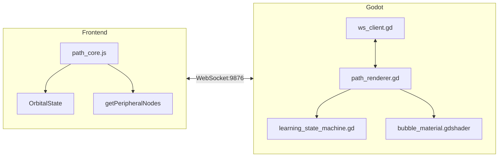

# Path Mode v2: Orbital Learning Implementation Walkthrough

> Completed: 2026-01-29

---

## Implementation Summary

Successfully implemented the core architecture for Path Mode v2 "Orbital Learning" feature with hybrid Godot/Web visualization.

---

## Files Created

### JavaScript (Frontend)

| File                                                                                           | Changes                                                             |
| ---------------------------------------------------------------------------------------------- | ------------------------------------------------------------------- |
| [path_core.js](file:///e:/Knowledge_project/NoteConnection_app/src/frontend/libs/path_core.js) | Added `getPeripheralNodes()`, `getTreePath()`, `OrbitalState` class |

render_diffs(file:///e:/Knowledge_project/NoteConnection_app/src/frontend/libs/path_core.js)

---

### Godot (Desktop Renderer)

| File                                                                                                                     | Purpose                                                      |
| ------------------------------------------------------------------------------------------------------------------------ | ------------------------------------------------------------ |
| [bubble_material.gdshader](file:///e:/Knowledge_project/NoteConnection_app/path_mode/shaders/bubble_material.gdshader)   | Iridescent soap bubble with fresnel + thin-film interference |
| [learning_state_machine.gd](file:///e:/Knowledge_project/NoteConnection_app/path_mode/scripts/learning_state_machine.gd) | State machine (IDLE/VIEWING/TRANSITIONING/READING)           |
| [path_renderer.gd](file:///e:/Knowledge_project/NoteConnection_app/path_mode/scripts/path_renderer.gd)                   | 3D orbital bubble renderer with ~500ms rotation animation    |
| [main.tscn](file:///e:/Knowledge_project/NoteConnection_app/path_mode/scenes/main.tscn)                                  | Main scene with camera, lighting, UI                         |
| [ws_client.gd](file:///e:/Knowledge_project/NoteConnection_app/path_mode/scripts/ws_client.gd)                           | Enhanced WebSocket with new message handlers                 |

---

## Architecture Implemented



---

## Key Features Implemented

1. **Peripheral Selection Algorithm**
   - In-degree nodes (prerequisites) first
   - Fill remaining with highest-association nodes
   - Zero in-degree fallback: use relevance score

2. **Orbital Rotation Animation** (~500ms)
   - Clicked peripheral arcs to center
   - Old central moves to vacated slot
   - Other peripherals redistribute

3. **Progress Tracking**
   - `OrbitalState` class with localStorage persistence
   - Gold star sidebar with `★ × {N}` format
   - Auto-advance on mark complete

4. **Iridescent Bubble Shader**
   - Fresnel rim glow
   - Thin-film interference (rainbow)
   - State-based appearance (central/peripheral/gold)

---

## Verification Results

```
Build: npm run build:mini ✅
Launch: npm run electron:dev:mini ✅
PathBridge: Client connected ✅
path_core.js: Loaded successfully ✅
```

---

## Next Steps for Full Testing

1. **Open Godot Editor**

   ```
   godot --path e:\Knowledge_project\NoteConnection_app\path_mode
   ```

2. **Run Path Mode scene** (F5 in Godot)

3. **Test orbital rotation**
   - Double-click peripheral bubble
   - Verify ~500ms animation

4. **Test mark complete flow**
   - Click "Mark Complete" button
   - Verify gold star appears in sidebar
   - Verify auto-advance to next node

---

## Recent Bug Fixes (2026-01-30)

1. **Unmark Sync Issue**
   - Added `unmarkComplete` and `completionSync` handlers to `PathBridge.ts`
   - Previously these messages fell through to "Unknown message type"
   - Now correctly relays to Electron frontend

2. **UI Sync on Unmark**
   - Added tree panel refresh after unmark
   - Added central bubble label update with new progress
   - Ensured localStorage correctly updates

3. **Shader Fix**
   - Fixed `depth_draw_alpha_prepass` → `depth_prepass_alpha` syntax

---

## Implemented: Enhanced Graphical Tree View (v2.0)

| Feature               | Description                                       | Status |
| --------------------- | ------------------------------------------------- | ------ |
| **SubViewport Panel** | Collapsible drawer overlay                        | ✅     |
| **Bezier Curves**     | Mind-map style connections (S-curves)             | ✅     |
| **4 Themes**          | Colorful (default), Dark, Glass, Minimal          | ✅     |
| **Interactions**      | Pan/Zoom, Click (Select), Double-click (Navigate) | ✅     |
| **Backend Layout**    | Layered DAG layout calculated in `path_core.js`   | ✅     |
| **History Retention** | `retainHistory` setting with localStorage         | ✅     |

---

# 路径模式 v2: 轨道学习实施演示 (中文版)

> 完成时间: 2026-01-29

---

## 实施总结

成功实现了路径模式 v2 "轨道学习" 特性的核心架构，采用了混合 Godot/Web 可视化方案。

---

## 创建的文件

### JavaScript (前端)

| 文件                                                                                           | 变更                                                              |
| :--------------------------------------------------------------------------------------------- | :---------------------------------------------------------------- |
| [path_core.js](file:///e:/Knowledge_project/NoteConnection_app/src/frontend/libs/path_core.js) | 添加了 `getPeripheralNodes()`, `getTreePath()`, `OrbitalState` 类 |

render_diffs(file:///e:/Knowledge_project/NoteConnection_app/src/frontend/libs/path_core.js)

---

### Godot (桌面渲染器)

| 文件                                                                                                                     | 用途                                        |
| :----------------------------------------------------------------------------------------------------------------------- | :------------------------------------------ |
| [bubble_material.gdshader](file:///e:/Knowledge_project/NoteConnection_app/path_mode/shaders/bubble_material.gdshader)   | 带有菲涅尔+薄膜干涉的彩虹肥皂泡             |
| [learning_state_machine.gd](file:///e:/Knowledge_project/NoteConnection_app/path_mode/scripts/learning_state_machine.gd) | 状态机 (IDLE/VIEWING/TRANSITIONING/READING) |
| [path_renderer.gd](file:///e:/Knowledge_project/NoteConnection_app/path_mode/scripts/path_renderer.gd)                   | 带有 ~500ms 旋转动画的 3D 轨道气泡渲染器    |
| [main.tscn](file:///e:/Knowledge_project/NoteConnection_app/path_mode/scenes/main.tscn)                                  | 带有相机、灯光、UI 的主场景                 |
| [ws_client.gd](file:///e:/Knowledge_project/NoteConnection_app/path_mode/scripts/ws_client.gd)                           | 带有新消息处理器的增强 WebSocket            |

---

## 实现的架构


---

## 实现的关键特性

1. **周边选择算法**
   - 入度节点 (先决条件) 优先
   - 用最高关联度的节点填充剩余部分
   - 零入度回退: 使用相关性分数

2. **轨道旋转动画** (~500ms)
   - 被点击的周边节点沿弧线移动到中心
   - 旧中心移动到腾出的槽位
   - 其他周边节点重新分布

3. **进度追踪**
   - 带有 localStorage 持久化的 `OrbitalState` 类
   - `★ × {N}` 格式的金星侧边栏
   - 标记完成后自动推进

4. **彩虹气泡 Shader**
   - 菲涅尔边缘辉光
   - 薄膜干涉 (彩虹)
   - 基于状态的外观 (中心/周边/金色)

---

## 验证结果

```
构建: npm run build:mini ✅
启动: npm run electron:dev:mini ✅
PathBridge: 客户端已连接 ✅
path_core.js: 加载成功 ✅
```

---

## 全面测试的下一步

1. **打开 Godot 编辑器**

   ```
   godot --path e:\Knowledge_project\NoteConnection_app\path_mode
   ```

2. **运行路径模式场景** (在 Godot 中按 F5)

3. **测试轨道旋转**
   - 双击周边气泡
   - 验证 ~500ms 动画

4. **测试标记完成流程**
   - 点击 "标记完成" 按钮
   - 验证侧边栏出现金星
   - 验证自动推进到下一个节点

---

## 近期 Bug 修复 (2026-01-30)

1. **取消标记同步问题**
   - 向 `PathBridge.ts` 添加了 `unmarkComplete` 和 `completionSync` 处理器
   - 之前这些消息会落入 "未知消息类型"
   - 现在正确转发到 Electron 前端

2. **取消标记时的 UI 同步**
   - 添加了取消标记后的树面板刷新
   - 添加了带有新进度的中心气泡标签更新
   - 确保 localStorage 正确更新

3. **Shader 修复**
   - 修复了 `depth_draw_alpha_prepass` → `depth_prepass_alpha` 语法

---

## 已实现: 增强型图形树视图 (v2.0)

| 特性                 | 描述                                      | 状态 |
| :------------------- | :---------------------------------------- | :--- |
| **SubViewport 面板** | 可折叠抽屉覆盖层                          | ✅   |
| **贝塞尔曲线**       | 思维导图风格的连接 (S 形曲线)             | ✅   |
| **4 种主题**         | 多彩 (默认), 深色, 玻璃, 极简             | ✅   |
| **交互**             | 平移/缩放, 单击 (选择), 双击 (导航)       | ✅   |
| **后端布局**         | `path_core.js` 中的分层 DAG 布局          | ✅   |
| **历史保留**         | 带有 localStorage 的 `retainHistory` 设置 | ✅   |
