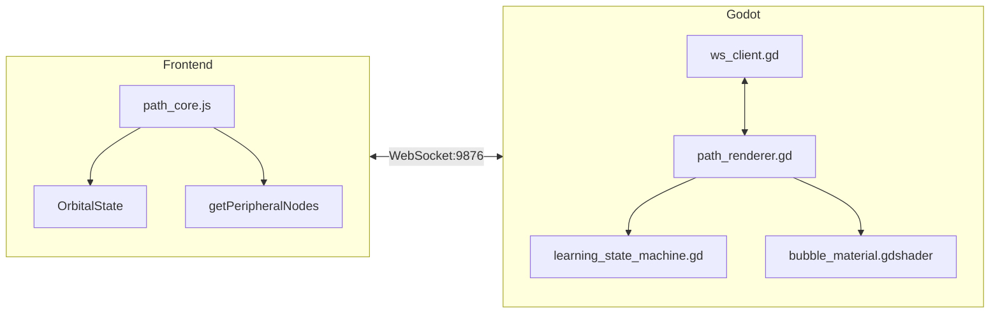

# Path Mode v2: Orbital Learning Implementation Walkthrough

> Completed: 2026-01-29

---

## Implementation Summary

Successfully implemented the core architecture for Path Mode v2 "Orbital Learning" feature with hybrid Godot/Web visualization.

---

## Files Created

### JavaScript (Frontend)

| File                                                                                           | Changes                                                             |
| ---------------------------------------------------------------------------------------------- | ------------------------------------------------------------------- |
| [path_core.js](file:///e:/Knowledge_project/NoteConnection_app/src/frontend/libs/path_core.js) | Added `getPeripheralNodes()`, `getTreePath()`, `OrbitalState` class |

render_diffs(file:///e:/Knowledge_project/NoteConnection_app/src/frontend/libs/path_core.js)

---

### Godot (Desktop Renderer)

| File                                                                                                                     | Purpose                                                      |
| ------------------------------------------------------------------------------------------------------------------------ | ------------------------------------------------------------ |
| [bubble_material.gdshader](file:///e:/Knowledge_project/NoteConnection_app/path_mode/shaders/bubble_material.gdshader)   | Iridescent soap bubble with fresnel + thin-film interference |
| [learning_state_machine.gd](file:///e:/Knowledge_project/NoteConnection_app/path_mode/scripts/learning_state_machine.gd) | State machine (IDLE/VIEWING/TRANSITIONING/READING)           |
| [path_renderer.gd](file:///e:/Knowledge_project/NoteConnection_app/path_mode/scripts/path_renderer.gd)                   | 3D orbital bubble renderer with ~500ms rotation animation    |
| [main.tscn](file:///e:/Knowledge_project/NoteConnection_app/path_mode/scenes/main.tscn)                                  | Main scene with camera, lighting, UI                         |
| [ws_client.gd](file:///e:/Knowledge_project/NoteConnection_app/path_mode/scripts/ws_client.gd)                           | Enhanced WebSocket with new message handlers                 |

---

## Architecture Implemented



---

## Key Features Implemented

1. **Peripheral Selection Algorithm**
   - In-degree nodes (prerequisites) first
   - Fill remaining with highest-association nodes
   - Zero in-degree fallback: use relevance score

2. **Orbital Rotation Animation** (~500ms)
   - Clicked peripheral arcs to center
   - Old central moves to vacated slot
   - Other peripherals redistribute

3. **Progress Tracking**
   - `OrbitalState` class with localStorage persistence
   - Gold star sidebar with `★ × {N}` format
   - Auto-advance on mark complete

4. **Iridescent Bubble Shader**
   - Fresnel rim glow
   - Thin-film interference (rainbow)
   - State-based appearance (central/peripheral/gold)

---

## Verification Results

```
Build: npm run build:mini ✅
Launch: npm run electron:dev:mini ✅
PathBridge: Client connected ✅
path_core.js: Loaded successfully ✅
```

---

## Next Steps for Full Testing

1. **Open Godot Editor**

   ```
   godot --path e:\Knowledge_project\NoteConnection_app\path_mode
   ```

2. **Run Path Mode scene** (F5 in Godot)

3. **Test orbital rotation**
   - Double-click peripheral bubble
   - Verify ~500ms animation

4. **Test mark complete flow**
   - Click "Mark Complete" button
   - Verify gold star appears in sidebar
   - Verify auto-advance to next node
